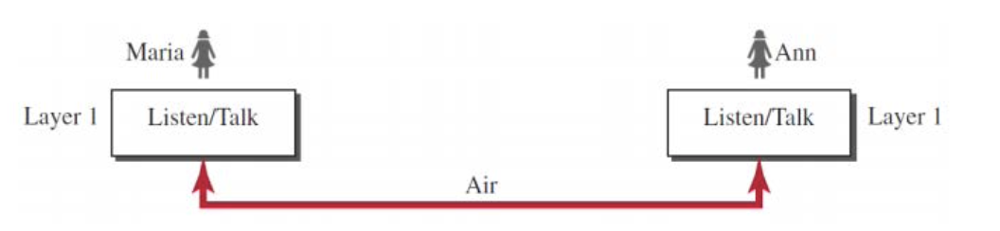
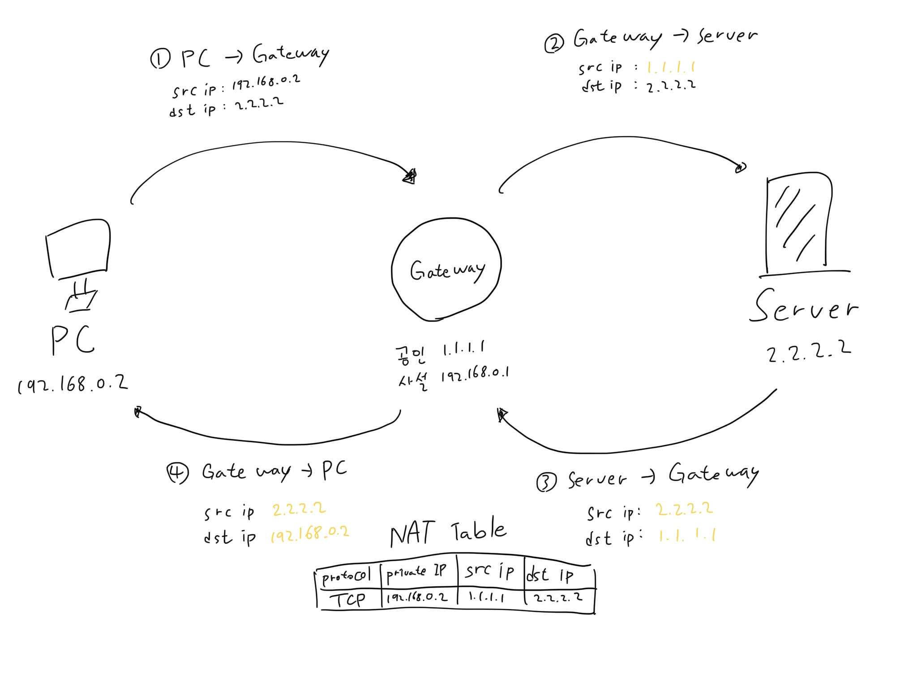
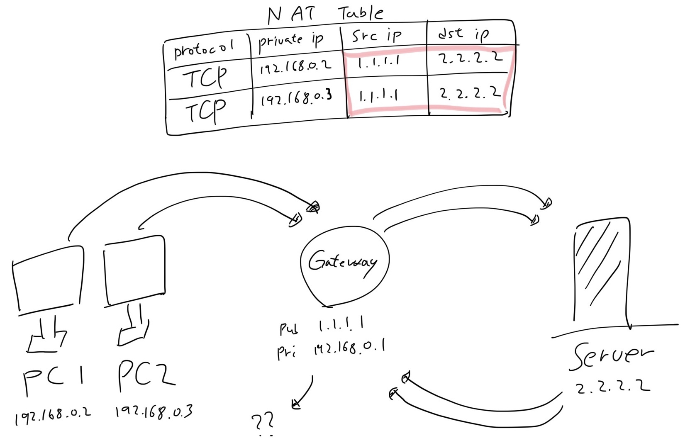

# netwhat

Holy Graph: 1Circle
간략한 내용: 컴퓨터 네트워크에 대한 간단한 기본 지식 및 계산 등을 요구
열: 2020년 12월 21일 오전 11:51
적정 기간: 3 days
제작에 참여한 사람: Jason Seo, 쑤 , 한찬호 ­, Lim Kiseong
질문게시판: https://www.notion.so/netwhat-09e8e720657345d784a23411f20ed7c5

- Tip Tip Tip!

    [[Netwhat] 연습문제 정리](https://velog.io/@hidaehyunlee/Netwhat-연습문제-정리)

    [netwhat 시험 안전하게 통과하기 !](https://42kchoi.tistory.com/155)

- 이 프로젝트는 코드를 작성하는 프로젝트가 아닙니다.
- 프로젝트를 시작하면 10분간 네트워크의 기본을 묻는 20문제들이 제시됩니다.
- 계산 문제가 특히 많기 때문에 슬랙 등에 게시되어 있는 IP Calculator를 사용이 필수적입니다.
- 실제로 평가를 받을 때는 지수승에 대한 연산도 필요하므로 공학용 계산기를 같이 이용하시면서 검증해주는게 좋습니다.
- 문제를 다 풀고 평가를 받게 되었을 때, 깃헙 레포를 클론하게 되면 answer.txt에는 키 값이 들어있습니다. 이 키 값을 netwhat.42.fr에 들어가서 로그인 후 입력하면, 풀었던 문제들의 정답 체크 및 본인의 답안을 확인할 수 있습니다. (자신의 답안에 대한 풀이 설명)
- 문제를 미리 풀어볼 수 있는 족보

    [adblanc/netwhat42-train](https://github.com/adblanc/netwhat42-train)

## Subjects

- [Basic Concept]()
    - [Protocol 이란?]()
    - [Protocol Layering 이란?]()
    - [OSI 7 Layer]()
    - [Internet Architecture의 목표]()
    - [End-to-End 원칙]()
    - [Curse of the Narrow Waist]()
    - [Internet의 3가지 요소]()
    - [NAI (Network Access Identifier)]()
    - [앞으로 알아나가야 할 것들?]()
- [IPv4 Address]()
    - [IPv4 들어가기 앞 서]()
    - [IPv4 Address 특성]()
    - [Classful IPv4]()
    - [IPv4 Packet Forwarding Method]()
    - [IPv4 Special Address]()
    - [Scaling Issues in Routing & CIDR (RFC4632)]()
    - [Subnet Mask]()
    - [Subnetting & Supernetting from CIDR]()
    - [IP통신이 동작하기 위한 최소 조건]()
- [IPv6 Address]()
    - [IPv6 들어가기 앞 서]()
    - [IPv6 Address 특성]()
    - [3 Types of IPv6 Address]()
    - [IPv6 Address Format]()
    - [IPv6 Special Address]()
    - [Unicast]()
    - [Anycast]()
    - [Multicast]()
    - [Solicited-Node Multicast Address]()
- [Public / Private IP Address]()
    - [Public IP]()
    - [Private IP]()
    - [NAT(Network Address Translation)]()
- [Network Layer Protocol]()
    - [IP (Internet Protocol) 설계 목적]()
    - [Basic of IP Operation]()
    - [IPv4 Header Format]()
    - [IP Function : Addressing]()
    - [IP Function : Fragmentation]()
    - [IPv4 Header Checksum]()
    - [Requirements for Internet Host (RFC1122)]()
    - [IPv4 Packet Forwarding]()
    - [ARP(Address Resolution Protocol)]()
    - [ICMP(Internet Control Message Protocol)]()
- [Transport Layer Protocol]()
    - [개요]()
    - [TCP]()
    - [UDP]()
- [Application Layer Protocol]()
    - [DHCP]()
    - [DNS]()

### 들어가기 앞 서...

컴퓨터 네트워크의 기본적인 지식들 (전반적으로 간략하게) 정리하려고 합니다. 빠진 내용들도 많을 거고, 부족한 부분도 많을 겁니다. 같이 컨트리뷰션 해주세요. 전공 서적을 보아도 좋고, 구글링도 좋고, 강의 자료도 좋습니다.

읽으면서 궁금한 부분들은 톡방에 올려주시면 작성한 사람이 도와줄 겁니다.
혹시 수정이 필요한 내용이 있다면 수정 후 수정 부분에 댓글을 남겨주시면 감사하겠습니다!

**Thanks to all contributors!**

중간 중간 가끔 어려운 단어들이 있지만 차근차근 읽어 내려가다 보면 설명이 되어있습니다!

만약 특정 용어를 몰라서 넘어가지 못하고 있다면 구글링을 통해 단어를 찾아보면서 학습하시면 됩니다!

한 번 읽고 모두 이해하는 것은 불가능 합니다... 이해하고 넘어가는 것 보다 다회독으로 공부하시는 방법을 추천드립니다~̆̈~̆̈

- 그래도 모르면 일단 넘어가고 차차 익혀가시길 바라요. (원래 어렵습니다.)
- 또한 아래의 글에서는 IP Packet이 Routing되어 전송되는 과정 및 TCP, UDP에 대해서는 구체적으로 다루지 않습니다. 이 부분이 궁금하다면 jseo(🐷)에게 물어봐주세요. (자세히 아는 건 아니지만.. 같이 찾아보면서 열심히 해볼게요 ㅎㅎㅎ..)

# 1. Basic Concept  [🔝]()

---

## 1) Protocol 이란?

정확히 3가지를 기억하면 된다.

- Format
- Order
- Action

많은 블로그에서는 프로토콜이란 Sender, Receiver의 상호 간의 규약 (통신을 효율적으로 혹은 특정 목적을 달성하기 위한) 이라고 명시를 해둔다. 그렇다면 그 규약이 무엇을 정의하고 있는지가 중요할텐데, 그것이 위의 3가지 키워드이다.

통신에 있어서 메세지의 형식이 어떠한지

네트워크 개체 간에 해당 메세지를 어떤 순서로 받을 것인지

자신이 해당 메세지를 받거나 전달했을 때 어떤 행동을 수행할 것인지

를 명시한 것이 Protocol 이다.

결과적으로...

1. 메세지에 대해서는 정확한 형식을 지키지 않으면 해석 자체가 불가능하며
2. 메세지의 형식이 올바르더라도 주어진 순서를 지키지 않으면 프로토콜에 대한 행동 수행이 불가능하고
3. 메세지 행동이 명확하지 않으면 형식과 순서를 지켜도 어떤 행동을 할지 알 수 없게 되어 무용지물이 된다는 것이다.

## 2) Protocol Layering 이란?

특정 프로토콜로 사용자와 통신을 하는 과정에서 메세지의 Delivery가 발생했다고 하면, Delivery외의 잡다한 일을 한 장치에서 모두 수행하지 않는다.

이 때 프로토콜이 수행하는 특정 행위 외의 모든 것들을 하위 프로토콜에게 맡긴다.

그렇다면 하위 프로토콜은 다시 하위 프로토콜에게 위임하고... 이런 Recursive Relationship이 발생하는데, 이 때의 논리구조를 Protocol Stack이라고 부른다. (층층이 둔다는 Layering의 의미와 동일)

그렇다면 Layering이 필요한 이유는 무엇인지 Single Layer 구조와 Triple Layer 구조를 통해 살펴보자.

### Single Layer Protocol (대면의 경우로 생각하자)



이 때의 요구 조건은 서로가 만났을 때 인사를 해야하며, 서로의 관계에 따른 할 말을 골라야하며, 상대가 말할 때는 침묵을 해야 하고, 서로가 헤어질 때는 잘가라는 인사를 해줘야 한다.

### Triple Layer Protocol (비대면의 경우로 생각하자)


이 때의 요구 조건은 만나지 않아도 (육체적으로 멀어도) 소통이 가능하고, 서로가 하고 싶은 말이 있다면 동시에 소통을 해도 되며, 암호화 덕에 둘 외에 다른 사람들은 소통에 참여를 할 수가 없으며, 내가 쓰고 싶은 말을 쓰기만 하면 직접 전달하지 않아도 전달이 보장된다.

즉, Layering을 하게 되면 한 층에서 프로토콜이 수행해야하는 행동 범위가 많이 줄어들면서 각자 자신의 임무만 명확히 수행하게 될 수 있는 장점이 생긴다. 따라서 Protocol Layering이라는 것의 정의는 복잡한 업무를 작은 일의 단위로 나누어 간단한 업무를 부담하게 하는 것으로 볼 수 있다.

비록 간단한 업무가 복잡해질 수 는 있더라도 Protocol Layering을 했을 때 다음과 같은 기대 효과를 얻을 수 있다.

- 프로토콜 간에 상호 독립적인 기능성만 둘 수 있다. (각 프로토콜의 독립적인 수정이 가능)
- 각 프로토콜의 내부를 일종의 블랙박스라고 여길 수 있다. (내부 동작 원리에 대해서 전혀 지식이 없더라도 Input을 넣었을 때 Output을 볼 수 있다.)

### Protocol Layering의 원칙은..

1. Bidirectional (양방향성) 통신을 해야하는 경우에 각 Layer는 송신과 수신 두 가지에 대해서 수행할 수 있어야 한다. (Sender, Receiver를 수행할 수 있어야 한다는 것)
2. 두 객체 아래의 Layer들은 동일하게 쌓여 있어야 한다.

    

    

## 3) OSI 7 Layer (Open System Interconnection)

OSI 7 계층은 매우 잘 정의된 개념적 구조라고 보면 된다. 각 프로토콜의 보편적인 역할을 설명하기 위해 사용된다. OSI 7 Layer는 ISO (International Organization for Standardization)에서 만들었으며, 이름 그대로 7개의 계층을 이룬다. 각 계층별 역할은 다음과 같다.

간혹 편의를 위해 아래 계층들을 4개의 Layer로 보기도 하는데, 1계층과 2계층을 묶은 Link Layer / Network Layer / Transport Layer / 5계층과 6계층 그리고 7계층을 묶은 Application Layer로 표현하기도 한다.


### [1]Physical (Physical Communication / LAN or NIC Hardware)

매채를 통해 비트 데이터를 Stream의 형태로 전송하고 받는 역할을 수행하여 기계적 전기적인 특성을 제공하는 Layer이다.

Data Link Layer로부터 받은 Frame을 실제 비트로 해석할 수 있도록 비트 스트림으로 만들어서 역할을 수행한다.

역할을 수행할 때는 비트를 Electrical Signal, Light Signal, Radio Signal 등으로 처리를 한다. 이 때 처리의 단위가 비트가 아닌 Signal인 이유는 여러 비트를 한 Signal에 넣어서 이용하고 이를 통해 처리 횟수를 줄일 수 있기 때문이다.

Signal, 시그널이란?
여기서 나온 Signal은 말그대로 전기 신호, 즉, 시간에 따라 전기의 흐름을 표기하는 것이다. 예전 과학시간에 전기가 통할때는 1, 안통할 때는 0으로 표현하는 시간 그래프를 본 적이 한번씩 있을 것이다. 혹은 AC, DC 그래프( 물결모양으로 생긴 파장그래프 ~ ←)들도 이러한 시그널이라고 생각하면 된다.
Physical 계층에서는 비트들을 이러한 Signal에 넣어서 물리적으로 통신을 진행한다!!

### [2]Data Link (Hop to Hop / NIC Driver)

비트 데이터 혹은 Packet을 Frame화 하여 기기 간 Hop-to-Hop 전달하는 역할을 수행해주는 Layer이다.

Packet, 패킷이란?
컴퓨터에서 데이터를 주고받을 때 정해둔 규칙이다.

Pack과 Bucket을 합친 말이다. 우체국에서 큰 화물을 적당한 크기로 나누어 행선지 등 정보를 표시하는 운송장을 붙이는데, 이러한 방식을 통신에도 접목시킨 것이다.

즉, 정보를 보낼 때 특정한 형태에 맞추어 보낸다는 것이다. 컴퓨터간 데이터를 주고받을 때, 네트워크를 통해서 전송되는 데이터 조각이라고 생각하면 편하다!
<출처> https://enlqn1010.tistory.com/9

Hop-to-Hop으로 전달한다는 의미는 서로 속한 네트워크가 같으면서 인접한 기기 (Adjacent Node)에게 데이터를 전달한다는 것이다.

기기가 가진 실제 주소(MAC 주소)를 이용한다.

MAC Address, 맥 주소란?
Media Access Control의 약자로 각 기기의 네트워크카드(하드웨어)에 부여된 고유한 물리적 주소이다! 즉, 모든 네트워크 장비는 자신만의 고유한 MAC주소를 가지고 있다. 48비트로 구성되어 있으며 16진수로 표시된다
 - 윈도우에서는 터미널 - ipconfig 명령어
 - Mac에서는 터미널 - ifconfig 명령어로 확인할 수 있다.

Data Link Layer는 Network Layer의 인터페이스로 작용된다. (즉, 성공적으로 데이터를 보내기 위해선 Network Layer는 목적지에 대한 명확한 Data Link Layer의 주소를 명시할 수 있어야 한다는 것이다.)

또한 Hop-to-Hop으로 인접한 기기에 전송된 데이터들은 Error가 없도록 전달된다. 즉, 수신 측 기기에서는 이미 올바른 데이터들을 무조건 받게되어 있다는 것이다. 이 덕에 수신 측에서는 수신한 데이터를 상위 Layer로 올릴 때 Error Free를 가정할 수 있다. (이미 올바른 데이터들을 받아 놓은 상태이므로 Error Detection만 가능하다면 Error Correction의 여지가 충분하므로 Error Free라고 할 수 있다.)

Transport Layer와 같이 Flow Control, Error Detection, Error Correction이 가능하다. 하지만 이는 Transport Layer의 것과는 조금은 다르다. Tranposrt Layer는 인터넷 상에서 Logical Connection 상태에서의 Layer 간 전달에서 일어나는 것이고, Data Link Layer에서는 네트워크 내의 기기간 전달에서 일어나는 것이다.

### [3]Network (Host to Host / Kernel Space of OS)

상호 간의 네트워킹을 위해 Packet의 형태로 Source에서 Destination으로 운송하는 역할을 수행하는 Layer이다.

단순히 목적지까지의 운송 역할만 수행하는 것이 아니라 정확히 따지자면, Network Layer는 Routing과 관련이 있다.

Routing, 라우팅이란?
상호 작용이 가능한 네트워크들을 구성하기 위해 독립적으로 운영되는 네트워크를 묶게 되면, Source에서 Destination까지 도달하기 위한 여러 경로(Multiple Routes)들이 생긴다. 이 때, Source에서 Destination까지 데이터를 보내는데 있어서 가장 좋은 경로를 결정하게 된다. 이렇게 찾아내는 기능 자체를 Routing이라고 보면 된다.

Internetworking 이란?
위에서 언급된 Internetworking이란 일종의 인터페이스(기기) 간의 Packet 송수신을 말한다. 즉, Endpoint 간의 Packet 송수신이 아니더라도 다른 네트워크의 Gateway 혹은 Router 간의 Packet 송수신도 이에 해당한다.
간단하게 최종 목적지 까지의 통신 뿐만 아니라 중간 개체들 까지의 송수신도 포함하는 것이다!

IP에 해당하는 것들이 Network Layer에 해당하는데, 이 때 IP는 Connectionless이며 단순히 목적지를 찾아가기 위한 용도의 Internetworking 서비스라고 보면 된다. IP 역시 기본적으로는 End-to-End의 Delivery를 보장해주진 않는다. (하지만 최선은 다한다. 이를 Best Effort Delivery라고 한다.)

Network Layer에서 사용하는 주소는 IP Address로 일종의 Logical Address이다. (말 그대로 기기에 대한 실질적인 주소는 아니다.) Public IP와 같이 사용되는 IP 주소는 사용자에 대해서 Uniquely, Universally Distinguishable하게 해준다.

### [4]Transport (Process to Process / Kernel Space of OS)

신뢰성 보장 등을 위해 정해진 순서대로 메세지를 구성하여 넘겨주어 에러에 대한 발견이나 수정을 수행해줄 수 있는 Layer이다.

Transport Layer의 가장 기본적인 기능은 Unreliable Data Delivery이다. (신뢰성을 보장해주지 않은채로 전달하는 것이 가장 기본적인 기능이라는 소리이다.) 즉, Connection-Oriented Protocol (TCP, SCTP, RTP 등)과 Connectionless Protocol (UDP) 중에서 후자가 Transport Layer의 가장 기본적인 기능을 수행하는 프로토콜이라고 보면 된다.

Connectionless Protocol과 달리 Connection-Oriented Protocol의 주된 5가지 기능은 다음과 같다.

1. Connection Management (TCP의 경우 3 Hand-Shaking)
2. Connection Multiplexing (Port를 이용한)
3. Segmentation (SCTP의 Chuck)
4. Reliable Delivery
5. Flow Control(수신 측에서 수행), Congestion Control (송신 측에서 수행)

### [5]Session (Peer to Peer / User Space of OS)

Session 대한 생성, 관리, 종료를 담당하는 Layer이다. (Session이라 함은 인간이 일하는 단위를 말한다. 또한 Connection을 담고 있는 것들이라서, 이 Connection을 관리한다.)

Endpoint를 사용하는 사용자 간의 Application Process들 사이에 Session을 열고 닫고 관리하는 메커니즘을 수행한다. 따라서 두 호스트 사이에 첫 Connection을 열기도 하고, 이렇게 열린 Session을 통해서 정해진 시간동안 데이터 송신과 수신을 가능하게 해준다.

예를 들면, VoIP(Voice over IP)에서 사용되는 SIP가 (Session Initiate Protocol) 이에 해당한다.

이러한 Session Layer가 중요한 이유는, Endpoint간 메세지 송신 수신을 진행하면서 Dialog Control(End의 Token을 이용하여 누가 전송할 차례인지에 대한 순서 조정 및 관리)과 Synchronization(Stream으로 들어오는 데이터에 대해서 동기화 지점을 기록)이 가능하도록 만들어주기 때문이다.

이러한 Session Layer에는 여러 경우들이 있는데.


One to Many의 경우 가장 일반적인 경우라고 보면 된다.

### [6]Presentation (Peer to Peer / User Space of OS)

데이터에 대한 Translate, Encrypt (Decrypt), Compress (Decompress) 등을 수행하는 Layer이다. (참고로 네트워크에서는 Big Endian을 사용한다.)

데이터를 Network Format에서 Application Format으로 바꾸거나, Application Format에서 Network Format으로 바꾸는 역할을 한다.

예를 들어서 송신 시에 Encoding, Compressing을 작업 했다면, 수신 측에서는 Decoding, Decompressing 작업을 수행한다.

### [7]Application (Peer to Peer / User Space of OS)

네트워크 자원에 접근할 수 있도록 해주는 Layer이다.

7개의 Layer 중에서 가장 위에 있는 Layer로써, 사용자와 직접 상호작용을 하며 동작하기 때문에 사용자에게 보이는 부분이다.

송신과 수신을 위한 데이터를 네트워크에 제공하는 역할을 수행한다.

예를 들면 Internet Explorer 혹은 Google Chrome과 같은 Browser가 있을 수 있고, Gmail과 같은 Email Client가 있다.


송, 수신 시에 송신 측에서는 7, 6, 5, 4, 3, 2, 1 계층을 거쳐 수신 측의 1, 2, 3, 4, 5, 6, 7 계층을 지나서 메세지가 전달된다. 이 때의 주고 받는 메세지의 데이터 형식은 아래와 같다.


### 그렇다면 OSI 7 Layer를 이용했을 때 장점은 무엇이 있을까?

1. 한 계층에서의 수정이 다른 계층에 대한 수정을 야기하는 것을 방지할 수 있다.
2. 산업적으로 표준화를 이끌어 낼 수 있다.
3. 네트워크 통신 과정을 여러 작은 요소로 쪼갬으로써 개발, 디자인, 문제 해결 등을 용이하게 한다.
4. 네트워크 구성 요소의 표준화를 통해  네트워크에 대한 여러 공급 업체를 개발할 수 있다.
5. 네트워크 관리자에게 네트워크 관리를 용이하게 할 수 있다. (문제가 생겼을 때 전체를 탐색하는 것이 아니라 해당 Layer만 찾아보는 식으로 빠르고 효율적으로 대처를 할 수 있다.)

## 4) Internet Architecture의 목표

주 목표는 존재하는 서로 연결된 네트워크들의 Multiplexed Utilization (다중 활용)을 위해 효율적인 기법을 만들어 내고자 하는 것이다.

부가적인 목표로는 다음과 같은 것들이 있다.

1. 한 쪽의 네트워크 혹은 게이트웨이의 손실이 있더라도 통신 자체는 가능해야 한다는 것

    (즉, 통신 중간 중간에 있는 장치(게이트웨이)들에는 미리 설정되어 있는 State가 없다. 이 말은 Endpoint 간에 서로에 대한 State들을 갖고 있는 형태가 되는 것을 의미하는데, 이렇게 통신하고 있는 Endpoint에 State를 두는 것을 Fate Sharing이라고 한다. Endpoint에 State를 몰아서 둬야 하므로 Endpoint에 사용되는 기기의 발전이 없다면 제약이 많은 형태였으나 과거에 미국방성에서 국방을 위해 어마어마한 돈을 들여가면서 발전하게 되었다. 결과적으로는 중간 중간 거점마다 State를 두지 않는 것이 큰 장점으로 다가올 수 있게 되었다. → 게이트웨이는 Stateless, Endpoint는 Stateful)

    

2. 여러 타입의 통신 서비스를 지원하고자 하는 것

    (TCP, UDP와 같은 여러 통신 프로토콜을 지원하는 것이 가능해야 한다. 다만, 상호 간 통신을 할 때는 서로 동일한 프로토콜을 이용해야 가능하다.)

3. 다양한 네트워크를 수용하는 것

    (LAN, 위성망, 패킷망 등과의 상호 연결을 할 수 있다. 즉, 기존에 존재하는 많은 망들과 서로 연결이 가능해야 한다. 이 때, 망 간에 서로 다른 기술들을 사용할 수도 있는 상황이기 때문에 서로 연결이 가능하도록 하기 위해선 자신 아래에 존재하는 기술(혹은 프로토콜)은 크게 신경 쓰지 않는다. 자신 아래에 존재하는 기술을 크게 신경 쓰지 않는 다른 이유로는 애초에 하나의 기능을 짤 때 일일이 다른 기능들을 고려하며 짜는 것이 어렵기도 하고, 자기 기능만 신경 쓰면 다른 기능들과 Independent하므로 수정에도 용이하여 어떤 기술에도 Mapping을 하여 이용할 수 있다는 장점을 두기 위해서다.)

    

4. 네트워크에 존재하는 자원을 분배 관리하는 것

    (자원들은 독립적인 AS (Autonomous System)에 의해서 관리 된다. 이런 AS들은 BGP(Border Gateway Protocol)에 의해서 서로 연결된다. BGP를 이용함으로써 Routing의 중앙 집권을 막을 수 있다. 이러한 관리가 중요한 이유는 18,000개의 Constituent Network가 존재하고, 1M 이상의 엔트리를 가진 Routing Table들이 많으며... 이에 대해선 많은 지출이 동반되기 때문이다. 그리고 AS간의 아주 작은 오류로 국가 간의 인터넷 접근에 굉장히 큰 장애를 만들 수도 있기 때문이다.)

    

5. Cost-Effective 하도록 만드는 것

    Packet Switched Network를 통해서 조금 더 비용을 절감할 수 있는 형태가 되었다. 모든 Packet들은 공용 인터넷을 통해 전달되는데, 이 때문에 Packet 전송 시 필요한 정보들이 오버헤드가 되는 단점은 존재한다. (추가로 붙은 정보들에 대한 Encapsulation, Decapsulation이 Overhead로 작용하게 된다.)

6. 적은 노력으로 새로운 호스트가 네트워크에 붙을 수 있도록 하는 것

    (IP는 굉장히 편리하게 Plug & Play가 가능하다. IP Stack을 이용하는 모든 것들은 인터넷에 연결 될 수 있다. 하지만 이 부분에 대해선 Endpoint 단말의 문제보다는 프로그래머의 역할이 중요하다. Endpoint를 이용하는 사용자들은 쉽게 사용하지만, 이렇게 쉽게 사용할 수 있도록 만드는 역할은 복잡한 기능들을 감당할 수 있는 시스템을 통해서 하게 된다. 그리고 이런 시스템에 대한 부담은 프로그래머가 지기 때문이다.)

7. Internet Architecture에서 사용되는 네트워크 자원을 모니터링할 수 있도록 하는 것

    (이 부분은 결국에 Billing과 직결된다. 기기에 대한 고장은 있을 수 있어도, 그렇다고 해서 Billing에 문제가 있으면 절대 안 된다.)

## 5) End-to-End 원칙

통신은 Endpoint와 Endpoint 간에 일어나는 것이고, 통신에 있어서 필요한 복잡한 기능들은 Endpoint에 위치하고 있어야 한다.

즉, Transport Layer와 Application Layer는 (5, 6, 7 계층을 보통 크게 묶어서 Application Layer라고 하기도 함) 호스트의 컴퓨터에만 존재하며, Router는 Network Layer, Data Link Layer, Physical Layer의 기능만 수행하게 된다. (Switch는 Data Link Layer 및 Physical Layer에 대한 기능을 지원한다.)

End-to-End 원칙을 고수하는 이유는 여러 기술을 쉽게 수용할 수 있도록 하여 확장성을 높이기 위함이다. 이런 이유 때문에 End-to-End 원칙은 네트워크 계층 설계에 핵심적으로 작용하지만, 실제로는 의도적으로 무시하는 경우들이 존재한다.

사용자들이 광고를 보는 조건으로 무료 WiFi를 제공 받는 상황이라고 할 때, 광고를 끼워넣기 위해서는 Endpoint 간의 통신에서 무선 공유기가 끼어들 수 있어야 한다. 또한 게임 서비스를 제공할 때 로드밸런서를 이용한다면, 클라이언트라는 Endpoint와 서버라는 Endpoint 중간에 로드밸런서라는 장비를 넣는 것도 일종의 End-to-End 원칙을 의도적으로 깬 것이라고 볼 수 있다. (보안 장비 혹은 토렌트의 트래픽을 별도로 처리하기 위한 QoS 장비들도 이에 해당할 수 있다.)


## 6) Curse of the Narrow Waist

**"IP위의 모든 것, 모든 것 위의 IP"** (IP over anything, anything over IP)라는 말이 있을 정도로 IP 위 아래로의 기술 발전이 많이 있었다.

때문에 IP에 대한 수정은 굉장한 어려움이 따른다(ㅜㅜ).

왜냐하면 Internet Architecture 목표들 중 다양한 네트워크 수용을 위한 대부분의 Independent한 기술들이(아무리 Independent하게 짜려고 해도), IP를 기반으로 개발을 진행해왔기 때문이다. 이로 인한 문제는 수정 뿐 아니라, 낮은 레벨에서는 굉장히 소량의 정보들만 이용할 수 밖에 없다는 어려움도 있다. (무선과 같이...)

## 7) Internet의 3가지 요소

1. **Host**

    (통신 서비스의 궁극적인 소비자이다.)

2. **Packet Network**

    (인터넷 프로토콜을 이용하는 호스트 컴퓨터의 통신을 지원해준다.)

3. **IP Router (같은 망 내에 있을 때는 Router, 다른 도메인의 경우 Gateway)**

    (상호 연결된 네트워크에서 Packet-Switching을 이용하는 컴퓨터를 Gateway 혹은 IP Router라고 부른다.)

## 8) Internet의 Architectural Assumption

1. 인터넷은 네트워크의 네트워크이다.
2. (Fate Sharing에서 언급 되었 듯이) Gateway는 Connection State를 담고 있지 않다.
3. Routing Complexity에 대한 정보는 Gateway에 있어야 한다. (메세지 전송을 위한 Path를 찾는데 사용된다. 이 때 호스트는 Routing에 관여 하지 않는다.)
4. 인터넷 시스템은 넓은 범위의 다양한 네트워크에 대해서 감당할 수 있어야 한다. (즉, 네트워크에서 사용하는 기술이 바뀌어도, 여전히 통신은 가능할 수 있어야 한다.)

## 9) NAI (Network Access Identifier)

Identity란 무엇일까? 바로 내가 누구인지 (Identifier), 내가 어디에 있는지(Locator)를 밝히는 것이라고 볼 수 있다. 이러한 Identity는 통신 시 요구되는 기본 사항이다.

통신에서 Identity를 요구하기 때문에 유선, 무선에 대해서도 각각 표준이 존재하며, 당연하게도 네트워크 통신에서도 이런 개념이 존재한다.

네트워크에서의 Identity는 NAI라고 하며 이는 RFC2486 (Obsoleted by RFC4282) → RFC4282 (Obsoleted by RFC7542) → RFC7542 순으로 발전해왔다.

**RFC(Request For Comment)란?**
인터넷과 TCP/IP에 대한 제안, 아이디어, 기술, 뉴스, 표준 등 종합적인 Note이다.
모든 인터넷 표준은 항상 RFC로 문서화되고 있다. IETF에서 이를 작성하고 있으며 RFC는 누구나 입수가 가능하다.

RFC7542: Domain간 로밍(인증) 서비스를 지원하기 위해 사용자를 구분할 수 있는 표준이 필요하다는 규정이다.

RFC4282에 NAI에 대해 아래와 같은 예제가 등록되어 있다.

username@realm
jseo@example.com

이러한 NAI에 대한 RFC7542에서 나타나는 Identifier는 RFC5322 + RFC6532를 따른다. RFC5322는 Internet Message Format을 기반으로 한 **사용자에 대한 부분(User Portion / username)**이고, RFC6532는 **위치에 대한 부분(Local Portion / realm)**으로써 Internationalized Email Header의 연장선인 이메일 형식으로 나타난다. 이렇게 정의된 Identifier는 대체로 utf8을 기반으로 작성되는데, 이런 utf8으로 작성된 realm 부분에 대해서는 Internationalized Domain Names (IDNs)에 맞는 호환성을 갖는 식으로 의도되어 있다. 따라서 RFC5890을 따른다.

- RFC5890은 Internationalized Domain Names에 대한 Syntax 정의 규약이라고 볼 수 있다. 기본적으로는 RFC1034(LDH라고 하여 "Letters, Digits, Hyphen"를 사용하는 Syntax)를 선호하고 따르는 분위기이지만, Symmetry Constraint만 지킨다면 A-label (ASCII), U-label (UNICODE)에 대한 이용이 가능하다.

이러한 NAI는 Application Layer에서 일반적으로 사용된다.

Application Layer에서 NAI를 통해서 사용자들과 도메인에 대한 구분을 지었듯이, **다른 계층에서도 각자만의 Identifier로 구분을 짓는다.** 예를 들면

- Data Link Layer에서는 Interface & Device & Node에 대한 구분을 위해 Interface Identifier (MAC)를 이용하고,
- Network Layer에서는 Host & Gateway에 대한 구분을 위해 Host Identifier (IP)를 이용하고,
- Tranport Layer에서는 Process 및 Program에 대한 구분을 위해 Endpoint (PID)를 이용한다.

## 10) 앞으로 알아나가야 할 것들?

Internet Protocol Stack에 대해서 명확히 알아야 한다.

1. 메세지가 인터넷 상에서 어떻게 전달 되는지
2. 각 프로토콜의 Layer의 목적은 무엇인지
3. 1과 2를 만족 하면서 각 프로토콜이 어떻게 동작하는지

적어도 이 세가지를 무난하고 정확하게 답할 수 있다면, 컴퓨터 네트워크에 대한 기본 지식은 깔려있다고 보면 되겠다.

- 출처

    고려대학교 COSE342 컴퓨터 네트워크 by 민성기 교수님

    [모듈화, End-to-end 원칙, 그리고 Fate-sharing](https://blog.ifunfactory.com/2016/03/29/모듈화-end-to-end-원칙-그리고-fate-sharing/)

# 2. IPv4 Address [🔝]()

---

## 1) IPv4 들어가기 앞 서

RFC791 (IP 표준에 대한 규약)을 따른다.

후에는 CIDR이라고 해서 Classless Inter-Domain Routing으로 주소를 할당하고 집계 전략을 펼쳤다. (RFC1519)

Private Internet에 대한 주소 할당 규약이 있다. (RFC1918)
Address Mask를 이용한 Internet Standard Subnetting Procedure (RFC950)가 존재한다.
IP Multicasting을 위한 Host Extension (RFC1112)이 존재한다.

## 2) IPv4 Address 특성

1. IPv4 주소는 Unique하고 Universal하여 Internet Protocol을 이용하는 네트워크에서 특정 목적지에 대해서 인지할 수 있다. (Public에 한하여) → 지금 나오는 Public에 대한 이야기는 [4장]()에서 다룬다
2. IPv4 주소의 길이는 32 비트이다. 32 비트는 4개의 Octet (8개의 비트)으로 나뉜다. 표현법은 2진수로 나타내는 표현과, 점으로 구분된 10진수로 나타내는 표현 2가지로 나뉜다.

     2진수 → 00000000 00000000 00000000 00000000
    10진수 → 0.0.0.0

3. 32비트의 각 4개의 Octet에서 표현이 가능한 범위는 (각 Chunk는 8비트므로) 0~255까지이다.

    따라서 10진수로 표현가능한 IP주소의 범위는
    0.0.0.0 ~ 255.255.255.255

4. IPv4 주소는 Network Part ([NAI]()에서의 Local Portion을 의미), Host Part (NAI에서 User Portion을 의미)로 구성된다. 여기서 사용되는 Network Part와 Host Part에 대한 (얼만큼의 길이로) 구분은 IP Class에 따라 나뉜다. → 여기서 더 나아가 Subnetting의 개념까지 들어가면 아래의 그림처럼 조금 더 Flexible하게 Host Part를 이용하면서 Hierarchical(계층적) Routing이 가능해진다.

    

    위와 같은 형태의 IPv4 주소를 Hierarchical IPv4 Address라고 하는데, 이를 통해 Hierarchical Routing이 가능해진다면 목적지 대상이 되는 네트워크를 쉽게 인식할 수 있어 IP Routing에 도움이 된다. (Routing에도 도움이 되지만, 이런 계층 구조는 IP 주소의 관리 측면에서도 굉장히 유용하다.)

5. IPv4 주소는 Classful이었다가 Classless 개념으로 바뀌어 나갔다. 이러한 변화로 4번과 같이 조금 더 Hierarchical한 구조를 띄게 되었다.

## 3) Classful IPv4

- **Class A**

    1번째 Octet은 Network Part, 나머지 3개의 Octet은 Subnet / Host로 활용

- **Class B**

    1, 2번째 Octet은 Network Part, 나머지 2개의 Octet은 Subnet / Host로 활용

- **Class C**

    1, 2, 3번째 Octet은 Network Part, 나머지 1개의 Octet은 Subnet / Host로 활용

- **Class D**

    Multicasting을 위한 IP

- **Class E**

    특정하게 목적이 정해져 있는 활동을 위한 IP


이 때 IPv4의 형태는 {<Network>, <Host>} 혹은 {<Network>, <Subnet>, <Host>}와 같은 형태인데, Subnet을 이용하는 경우의 Mask 주소 형태는 {-1, -1, 0}가 된다. Masking 비트들은 1로 채워져서 &연산을 통해 Host를 분별해낼 수 있다. (이 때 채워진 모든 1값들은 비트가 꽉 차있는 형태므로 -1로 표현하는 것이다.

- 부호가 있는 2진수 표현법

    2진수의 첫 비트를 부호비트로 만들고 나머지 비트들로 숫자 표시를 한다.
    예를들어 4비트의 경우

    ```c
    |  0 | 000 |
    | 부호| 숫자 |
    ```

    따라서 숫자 4비트로 표현가능한 양수는 0 ~ 7, 음수는 -1 ~ -8 이다. 앞의 비트가 1이면 부호가 마이너스이다.

    ```c
     0 = 0000
     1 = 0001
     ...
     7 = 0111
    -8 = 1000
    -7 = 1001
     ...
    -1 = 1111
    ```

    따라서 위의 마스크의 주소 형태가 -1 이라는 것은 주소가 모두 1로 채워져 있다는 것이다. 예를들어 아래와 같은 주소를 {-1, -1, 0} 으로 표현할 수 있는 것이다.

    11111111 11111111 11111111 00000000

## 4) IPv4 Packet Forwarding Method

### [1] Unicast

**MAC Address를 기반으로 상대측 IP주소를 목적지로하는 1:1 통신**

현재 네트워크에서 **가장 많이 사용되는 방식**이다. 유니케스트 방식은 하나의 송신자가 다른 하나의 수신자로 데이터를 전송하는 방식으로 일반적인 인터넷 응용프로그램이 모두 유니캐스트 방식을 사용한다. 유니캐스트 통신은 목적지를 제외한 다른 네트워크상의 PC들의 CPU성능을 저하시키지 않는다! 그 이유는 **자신에게 온 패킷이 아니라고 판단되면 랜카드에서 해당 Frame을 버리기 때문**이다!

만약 동일한 데이터를 여러 수신자에게 보내고 싶다면, 유니캐스트 통신을 사용하면 데이터를 여러번 전송해야 하며 동일한 패킷의 중복 전송으로 인해 네트워크 효율이 저하된다!


### [2] Broadcast

**로컬 랜 상에 붙어있는 모든 네트워크 장비들에게 보내는 1: N(all) 통신**

여기서 로컬이란, 라우터에 의해서 구분되어진 공간, 즉 브로드캐스트 도메인이라고 하는 공간을 뜻한다. 브로드캐스트 주소로 패킷이 오면 자신의 MAC주소와 같지 않아도 무조건 읽어서 CPU로 전달한다.

반드시 필요한 통신방식이지만, 데이터 수신이 필요없는 호스트들에게도 데이터가 전송되기 때문에 불필요한 인터럽트가 발생된다. 또한 자신이 속한 네트워크에만 한정된고, 라우터를 경유하지 못한다는 단점이 있다.

**브로드캐스트를 사용하는 예시!**

1. ARP(Address Resolution Protocol)

    처음 두 PC간에 통신을 하는 경우에, 상대 IP는 알 수 있더라도 MAC address는 알 수가 없다!

    이 때, 상대편의 맥주소를 알기 위해서 하는 프로토콜이 바로 ARP이다!

2. 라우터끼리 정보를 교환하거나 다른 라우터를 찾고 싶은 경우
3. 서버가 자신이 어떤 서비스를 제공한다는 것을 모든 클라이언트들에게 알릴 때
4. DHCP를 통해서 자신의 IPv4 주소 설정을 진행할 때


### [3] Multicast

**하나 이상의 송신자들이 특정한 하나 이상의 수신자들에게 데이터를 보내는 통신**

멀티캐스트의 경우 자신이 데이터를 받기 원하는 특정 호스트들에게만 보내는 것이 가능하지만, 스위치나 라우터가 이 기능을 지원해주어야 한다! 멀티캐스트 전송을 위한 그룹 주소는 D Class IP주소 (224.0.0.0 ~ 239.255.255.255)로 실제 호스트를 나타내는 주소가 아니며 그룹 주소를

예를 들어, 네트워크 상에 200명의 사용자가 있을 때, 150명에게만 정보를 보내고 싶을 때 사용하는 통신이다. 브로드캐스트를 사용하면 해당 데이터가 필요하지 않은 50명의 PC성능이 저하된다, 유니캐스트를 사용하면 같은 패킷을 150번 전송해야 해서 비효율적이다. 즉 이러한 문제를 해결하기 위한 통신 방법인 것이다.


Multicast는 IP Network 상에서 One-to-Many 통신을 위한 기법이다. Multicast는 (많은 수신자를 목표로 하더라도) Packet이 한 번만 전송될 수 있도록 자원을 끌어모으는 식으로 네트워크 인프라를 효율적으로 사용한다.

## 5) IPv4 Special Address

- 0.0.0.0 ({0, 0} / {0, <Host>}

    

    IPv4 Packet을 전송하려는 컴퓨터에서 자신의 주소 (SIP)를 모르는 경우에 자신의 IPv4 주소로 0.0.0.0이 이용된다.

    예를 들면, DHCP Discover와 같은 작업에 이용되는데 아래 그림과 같이 IPv4 Packet을 날리면 DHCP 서버로 부터 답을 받을 수 있다.

    

- 255.255.255.255 ({-1, -1} / {<Network>, -1} / {<Network>, <Subnet>, -1}, {<Network>, -1, -1})

    

    모든 비트가 1인 IPv4 주소는 Broadcasting에 이용된다. 또한 특정 네트워크 전체에 보내는 Broadcast가 아닌 아래 그림과 같이 특정 Subnet에만 보내는 Broadcast의 경우, 정해진 전체 네트워크에 Broadcast Packet을 뿌리는 것이 아니라 특정 Subnet에 Broadcast Packet을 뿌리는 것도 가능하다. 이를 IP Directed Broadcast라고 한다.

    

    이와 같이 IP Directed Broadcast로 Packet을 날리게 되어서 Target Subnet을 향해 경로 타고 가면, 네트워크는 이 Packet을 Unicast Packet을 전송할 때와 동일한 방법으로 Forwarding 한다. (즉, Unicast Packet과 동일한 취급을 한다.)

    이렇게 Target Subnet에 연결된 Switch까지 Unicast처럼 전송된 Packe은 해당 Switch에 도착하면, 해당 Switch가 Subnet에 해당한 모든 Endpoint 단말에게 Packet을 Broadcast해준다.

- 127.0.0.1 ({127, <Any>}

    

    자기 자신(Local Host)을 나타내는 Loopback Address이다.

    Loopback Address란 해당 주소로 접속했을 때 자신의 컴퓨터에 접속할 수 있는 주소이다. 네트워크 관련 프로그램이나 환경의 테스트를 위한 목적으로 사용한다.

- Private IPv4 Address

    

    Private Network과 통신할 때 사용되는 Address이다. (기관 등에서 전화 회선 연장을 위해 사용하는 것과 비슷하다.)

    

## 6) Scaling Issues in Routing & CIDR (RFC4632)

1. IPv4 Address 공간에 대한 비효율적인 이용

    클래스 C에서의 2개의 호스트 → (2 / 254 = 0.78% Efficient) ($2^8 - 2 = 254)$

    클래스 B에서의 256개의 호스트 → (256 / 65536 = 0.39% Efficient) ($2^8 * 2^8 - 2 = 65534)$

    IPv4 주소가 차지하는 공간의 수가 굉장히 빠르게 소모되는 것을 볼 수 있다.

2. 너무나도 많은 네트워크들

    Routing Table은 확장되지 않는다.

    Routing Propagation Protocol 역시 확장 되지 않는다.

    Forwarding을 위한 큰 Routing Table을 Router가 스캔할 때 굉장히 느려진다.

→ 그래서..? 클래스에 대해서만 인식하던 인터넷에 대해 클래스 개념을 없애보는 쪽으로 2006년 08월에 CIDR (Classless Inter-Domain Routing (RFC4632))이 제시되었다. (IPv4 주소에 대한 자유도가 올라감)

CIDR은 클래스 A, B, C의 Network Part 개념을 Classless한 Prefix로 바꾼 것을 말한다. (기존 클래스 A, B, C에 대해서 Class를 없애면, 어디 부분까지가 Network Part이고, 어디 부분까지가 Host Part인지 구분이 불가능하므로 Subnet Mask에 대한 필요성이 등장...) 이 때, Network Part는 특정 범주 내에서 사용되는 Endpoint 단말의 Network Part를 이용한다.

Subnet Mask는 다음 파트에서!!

CIDR 표기법에서 Prefix는 기존 IPv4 주소처럼 4개의 Octet으로 표기되며 그 뒤에 "/" 가 붙으면서 이어서 특정 비트 수에 대해서 명시한다. IPv4 주소의 경우 32비트의 길이를 갖기 때문에, "/" 뒤에는 0~̆̈32 사이의 10진수 값이 표기 된다.

암묵적으로 255.255.0.0의 네트워크 주소 Mask를 이용하는 기존 클래스 B 네트워크의 172.16.0.0 IPv4 주소는 CIDR 표기법으로 172.16.0.0/16이 된다.

## 7) Subnet Mask

Subnetwork 혹은 Subnet이라고 부르는 것은 IP Network에 대한 논리적 분할이다.


Subnet Mask 혹은 Subnetwork에 대해서 알아내고자 계산을 할 때는, Logicial Multiplication을 이용한다. 예를 들어서 192.168.0.1/24라는 CIDR 표기법으로 나타낸 IPv4 주소가 주어졌다고 해보자. 이에 따른 Subnetwork를 구할 때는 IPv4에 Subnet Mask 값을 & 연산을 취하면 되고, Subnet Mask 값을 구할 때는 IPv4에 Subnetwork를 & 연산을 취하면 된다.

IPv4 by Binary → $1100 0000$ . $1010 1000$ . $0000 0000$ . $0000 0001$

Subnet Mask   → $11111111$ . $11111111$ . $11111111$ . $0000 0000$

---

Subnetwork     → $11000000$ . $1010 1000$ . $00000000$ . $00000000$

이 때의 추가로 사용할 수 있는 Host는 253개 이다. (자기 자신 IP, 네트워크 자체에 대한 IP {<Network>, 0}, 네트워크의 Broadcast IP {<Network>, -1}을 제외한...)

Subnet Mask 값의 목적은 Host Part 부분에 대한 유동적인 분할에 대한 명시이다. Subnet 자체는 해당 네트워크 내부에서만 확인이 가능하다. 단순히 IPv4 주소만 주어진 상태에서는 Subnet이 어떻게 되는지 알 수 없다. 따라서 아래와 같이 클래스 B의 IPv4가 주어졌을 때는 어떤 Subnet인지 알 수 없지만, Subnet Mask가 주어지면 어느 Subnet을 이용하고 있는지 알 수 있다. (계산할 때는 항상 2진수!)


## 8) Subnetting & Supernetting from CIDR

두 Netting 모두 Network Mask를 사용한다.

- Subnetting

    **큰 네트워크를 작은 여러 개의 네트워크로 나누는 기법이다.**

    네트워크 구조를 계층적으로 둘 수 있다. Supernetting과 마찬가지로 Routing에 도움을 준다.

    기존 네트워크 Prefix에서 추가적으로 그룹을 형성하여 나눴기 때문에 그룹에 따라서 네트워크 Prefix를 위한 비트 수가 증가한다.

    예를 들어서 클래스 B 네트워크의 경우, 256개의 클래스 C 네트워크로 나눌 수 있다. 이 때의 Network  Part의 Prefix는 16 비트에서 24 비트로 증가한다.

    

    기존에 클래스로 이용되던 네트워크

    

    Subnet 개념이 생기고 난 후의 네트워크

    다음을 풀어보자

    

    - 정답

        Q1) Class : C  Subnet : 201.222.10.56
        Q2) (1) /26  (2) 4  (3) 248  (4) 211.100.10.192
        풀이가 궁금하다면 슬렉아이디 suhshin 에게 물어보세요!

- Supernetting

    작은 여러 개의 네트워크를 하나의 큰 네트워크로 묶는 기법이다.

    그루핑을 도와주기 때문에 Routing Entry가 좋아지게 되고 이를 통해 Router의 Lookup이 편해진다.

    기존에 여러 네트워크를 하나의 그룹으로 묶어냈기 때문에 기존에 이용하던 네트워크 Prefix의 비트 수가 감소한다.

    예를 들어서 4개의 클래스 C 네트워크를 하나의 네트워크로 Supernetting한 경우, Network Part의 Prefix는 24 비트를 사용하다가 2 비트 (4개의 클래스 → $2^2$ → 2 비트) 만큼 줄어서 Network Part의 Prefix는 22 비트로 이용하게 된다.

    Supernetting에 대한 표현은 Supernetting된 네트워크 IPv4 주소와 묶을 수에 대한 소괄호 쌍으로 표기한다. (<IPv4 Address>, <Count>)와 같이 표기한다.

    예를 들어서 (192.5.48.0, 3)이라고 하면  실제로는 192.5.48.0, 192.5.49.0, 192.5.50.0 이렇게 세개가 묶인 것이다. 이에 대한 풀이는 아래와 같다.

    → 48.0으로 Supernetting 된 것이니 이를 2진수로 변환 해보면 $00110000$ . $00000000$ 인데, 여기서 3개를 묶기 위해선 2개의 비트 (4개의 사용자에 대한 커버리지 → $2^2$ → 2 비트)가 필요하다는 사실을 알 수 있다. 클래스 C IPv4 주소에 대해서 2개의 비트를 이용한 Supernetting을 한 것이니, 24개의 비트에서 2개의 비트가 줄어서 22개의 비트로 그루핑을 한 것이라고 볼 수 있다는 것이다. 그럼 그루핑 된 3개의 IPv4 주소는 $00110000$ . $00000000$ (48.0), $00110001$ . $00000000$ (49.0), $00110010$ . $00000000$ (50.0) 3개가 됨을 알 수 있다.

    비슷한 예로 X.Y.32.1 ~ X.Y.32.254 (첫 번째 클래스 C 주소들), X.Y.33.1 ~ X.Y.33.254 (두 번째 클래스 C 주소들), X.Y.34.1 ~ X.Y.34.254 (세 번째 클래스 C 주소들), X.Y.35.1 ~ X.Y.35.254 (네 번째 클래스 C 주소들)이 주어졌을 때, 네 그룹을 모두 묶을 수 있는 Supernetting 주소는 (X.Y.32.0, 4)가 된다.

    → 32.0은 $00100000$ . $00000000$, 33.0은 $00100001$ . $00000000$, 34.0은 $00100010$ . $00000000$, 35.0은 $00100011$  . $00000000$이다. 이 때 클래스 C에 대한 Network Prefix는 24 비트인데 4개의 그룹을 묶어야 하므로 위의 예제와 마찬가지로 2개의 비트가 감소되어 그루핑 된다. 즉 22개의 비트에 대해서 Masking을 하면, $00100000$ . $00000000$이 되어 32.0이 최종 Supernetting 결과가 된다.

    다음 예시도 위와 똑같은 방식으로 이뤄지는 것을 볼 수 있다.

    

## 9) IP통신이 동작하기 위한 최소 조건

1. IPv4 Address
2. Subnet Mask
3. Default Gateway
4. Default DNS Server


- 출처

    고려대학교 COSE342 컴퓨터 네트워크 by 민성기 교수님

# 3. IPv6 Address [🔝]()

---

## 1) IPv6 들어가기 앞 서

RFC4291 (IPv6에 대한 표준 규약)을 따른다. IPv4와는 Incomptiable 한 형식이므로 서로에 대한 Translator가 있어야 IPv4와 통신이 가능하다. 이렇게 Translator를 두는 방식은 굉장한 불편함이 따르기 때문에 해결방법을 위해 IPv4에 대해서 IPv6에 겹치는 오버레이 방식을 통해서 해결하는 방법이 선호된다.

## 2) IPv6 Address 특성

1. IPv6 주소의 길이는 128 비트이다. (16 바이트) → 이는 곧 $2^{128}$로 약 340 * Billion * Billion * Billion개 만큼 주소를 사용할 수 있다는 의미이다.
2. IPv4 주소에서는 Octet을 . (Dot)으로 구분 했다면, IPv6 주소에서는 2개의 Octet을 : (Colon)으로 구분한다.
3. 1개의 바이트는 2개의 16진수로 표현되며 (1 바이트 = 8 비트 = 2개의 16진수), 총 16 바이트 길이를 2 바이트 단위로 묶으면 8개의 그룹이 : (Colon)으로 구분 되는 형식이므로 총 32개의 16진수로 표현된다. (한 그룹당 4개의 16진수로 표현되므로)
4. 간혹 주소 표현에 있어서 :: (Double Colon)으로 표기된 것을 볼 수 있는데, 이 의미는 0으로 채워진 2 바이트가 여러 그룹 있다는 것이다.

    

5. IPv6 주소의 경우 64 비트의 Network Prefix와 64 비트의 Interface Identifier로 구성되기 때문에, IPv6 주소는 Node가 아닌 Interface에 할당된다. (모든 Interface는 적어도 1개 이상의 Link-Local Unicast 주소를 갖고 있어서 이를 활용할 수 있다.) 따라서 하나의 Interface는 Unicast, Multicast, Anycast에 따른 여러 IPv6 주소를 가질 수 있다.
6. IPv4 주소와 마찬가지로 IPv6 역시 Subnet Prefix는 하나의 링크에 할당되어 있는 형태이다. (원래 Subnet Prefix는 하나의 링크와 연관되어 있다.) 따라서 아래와 같이 동일한 링크에 대해서 여러 Subnet Prefix가 존재할 수 있다. 아래 그림은 3개의 IPv6 Subnet이 나타나 있다.

    

7. IPv6 주소에서는 오로지 Network Mask로써 CIDR 표기법만 따른다. (클래스 없이)

## 3) 3 Types of IPv6 Address

IPv6 주소는 아래와 같은 통신 형태에 따라 여러 주소를 가질 수 있다.

1. **Unicast**

    하나의 Interface를 나타내기 위한 Identifier

2. **Anycast**

    (Unicast와 크게 다를 것이 없이 Unicast 특성을 가진다. 다만 대표 전화와 같이 한 Interface에서만 수신할 수 있으면 된다.) 여러 Interface들에 대한 대표 Identifier

3. **Multicast**

    Anycast와 같이 여러 Interface들에게 전송되었을 때 받을 수 있는 Idenfier이다. (Mutlicast는 그닥 좋은 통신은 아니다. Multicast를 받기 위해 그룹에 소속된 Node들이 쓸데없는 일을 하게될 수도 있다.) Anycast는 여러 Interface들에게 전송했을 때 하나의 Interface만 받을 수 있으면 되었다면, Multicast는 Identifier를 가진 모든 Interface가 Packet을 받게 된다.


IPv6 주소 체계

## 4) IPv6 Address Format

IPv6의 Unicast 주소에는 링크에서 Interface를 확인할 수 있는 Interface Identifier가 사용된다고 했었다. 이 때 Interface Identifier는 64 비트의 길이이며, Modified EUI-64 Format을 따른다.

IPv6 주소에 IID (Interface Identifier)가 사용되기 위해선, Subnet Prefix 범위 내에서 Unique 해야한다. (IID의 Unique함은 IPv6의 Unique와 독립적이다.)

위와 같이 제시된 IPv6 주소의 형태는 아래 그림과 같다. 만일 Global Unicast Address로써 IPv6 주소를 나타내면, IID는 64 비트로 고정이고 n + m 역시 64 비트가 된다.


IID는 Modified EUI-64 Format을 따른다고 했었는데, 이에 대해서 알아보자. EUI라는 말은 Extended Unique Identifier의 약어이다. EUI는 IPv6 주소에서 사용되는 IID에 대해서 64 비트의 길이의 Unique함을 보장해준다. 이 때의 EUI를 EUI-64라고 한다. IPv4 주소와 달리 IPv6에서의 주요한 장점이 바로 EUI에 있다. 바로 IPv4 주소 체계에서 IPv4 주소 할당을 위한 수동 설정 및 DHCP의 필요성을 없애주기 때문이다. (그럼 IPv6 주소는 어떻게 생성되냐? → Node 자체가 MAC 주소를 이용하여 IPv6 주소를 생성하여 할당한다.)

EUI-64 Format을 지키기 위해선 어떤 형식을 만족해야 하는지 조금 더 자세히 알아보자. 모든 기기들은 같은 네트워크 위에선 같은 Mapping 기법을 사용해야하는데, 대체적으로 Data Link Layer에서의 보편적인 방법은 IEEE 802 MAC 주소를 사용한다. 이 때 Data Link Layer에서 사용하는 MAC 주소는 48 비트의 길이이고, EUI-64는 64 비트 길이인데다가 EUI-64 Format에서는 MAC 주소가 사용된다고 했었는데 부족한 16 비트는 어디서 채워올까? Data Link Layer의 48 비트 길이의 주소는 24 비트 씩 쪼개서 Upper 24 비트, Lower 24 비트로 볼 수 있는데, Upper 24 비트는 OUI (Organizationally Unique Identifier)를 의미하고 Lower 24 비트는 기기의 Identifier를 의미한다. 이 때 EUI-64 Format은 MAC 주소의 Lower 24 비트의 일부를 건드려서 기기의 Idenfier를 40 비트로 늘려 64 비트를 만들어 낸다. (OUI는 건드리지 않는다.)

MAC 주소의 형태는 아래 그림과 같다.


이 때 16진수로 표현된 각 값들이 실제로 통신에서 전송될 때는 뒤집혀서 전달된다.


이런 과정이 일어나는 것은 아래 그림과 같이 각 Octet별 표현이 있을 때, 각 Octet의 LSB부터 (끝에서부터) 전송이 되기 때문이다.


EUI-48에서 EUI-64를 만드는 과정을 그림으로 살펴보자.


이 때, IPv6 주소는 EUI-64 Format을 사용하긴 하나, Modfied EUI-64 Format을 이용함을 유의하자! (단순히 EUI-64 Format을 이용하는 것이 아니라 3번 과정처럼 7번째 비트에 대해서 상황에 맞는 변화를 주어 이용한다.) 위의 조건이 나타내는 것을 통해 알 수 있듯이, IPv6의 주소를 비트로 나타내어 첫 번째 바이트의 7번째 비트를 보면 Unique함을 알 수 있다.

## 5) IPv6 Special Address

IPv6의 Speical Address는 IPv4 주소와 크게 다를 것은 없다.

- Unspeicified Address

    0:0:0:0:0:0:0:0 혹은 :: 주소는 IPv6 주소의 부재를 의미한다. IPv4의 0.0.0.0과 동일한 표현이다. Unique한 주소를 받기 위해 전달하는 Packet의 Source의 임시 주소로 이용된다.

- Loopback Address

    IPv4 주소의 127.0.0.1과 동일한 표현이다. IPv6 주소에서는 0:0:0:0:0:0:0:1 혹은 :: 1로 표현한다. Loopback 주소를 향한 Packet은 절대로 IPv6 Router로 Forward 되지 않는다. (다음 링크로도 나가지 않는 것도 당연하다.)

- IPv4-Mapped IPv6 Address
    1. IPv4-Compatiable IPv6 Address (Deprecated) → IPv6 컴퓨터인데 IPv4에 연결된 경우
    2. IPv4-Mapped IPv6 Address → IPv4 컴퓨터인데 IPv6 주소를 할당하는 경우

        아래 그림과 같은 상황일 때, 주소를 다음과 같이 Mapping 한다. 80 비트는 0으로 채우고, 16 비트는 1로 채운 뒤 (만일 이 부분의 16 비트가 0으로 채워져 있다면 이는 IPv4-Mapped IPv6 Address가 아닌 IPv4-Compatiable IPv6 Address이다.) , 32 비트 길이의 IPv4를 씌운다.

        

## 6) Unicast

IPv6 Unicast 주소의 범위는 크게 3가지로 나뉜다.


1. Link-Local Scope

    Link-Local Addresses라고 부른다.

    하나의 링크 범위 내에 속한 모든 호스트들에 대한 Identifier

    (Link-Local Scope에 해당하는 주소는 Link-Local Addresses와 Site-Local Addresses가 있는데 후자는 Deprecated 되었다.)

2. Unique-Local Scope

    Unique-Lcoal Addresses라고 부른다.

    특별히 관리되는 범위 혹은 별도의 링크 내에 속한 모든 호스트들에 대한 Identifier

3. Global Scope

    Global Unicast Addresses라고 부른다.

    모든 인터넷 상에서 기기가 도달할 수 있는 Identifier

이 때 이에 따른 Unicast IPv6 주소에 대해서는 여러 타입이 존재한다.

1. Global Unicast Address

    이 Unicast 주소는 IPv4의 주소와 일맥상통하다. Globally Routable하고, Reachable하다. 다만 수평적이면서도 계층적인 IPv4 환경의 인터넷과 조금은 다른 점이 있다면, IPv6 환경의 인터넷은 설계부터 효율적이고 계층적인 주소와 Routing을 목적으로 되어 있다는 것이다. Global한 Scope를 두어 통신하려는 Unicast 주소는 최상위 3개의 비트가 001로 되어 있다.

    

    그림에서 알 수 있듯이 Global Unicast Address는 3가지 영역으로 나뉘어져있다. 첫 3개의 비트는 001로 고정되어 있고, 그 외에 Global Routing Prefix (Site Prefix), Subnet ID, Interface ID로 나뉘어져 있다.

    여기서 Global Routing Prefix는 Leaf Site로 기관에 등록된다. 이는 Provider Prefix로써 등록된다. 이렇게 등록된 Prefix는 추가 16 비트를 Subnet ID로 이용이 가능하다. 따라서 기관은 최대 65535개의 Subnet을 생성할 수 있다. Host 부분은 Node의 Interface Identifier로써 기록된다. 이에 대한 예는 아래 그림과 같다.

    

2. Link-Local Address

    주로 링크 상의 이웃 사이에 사용되거나, NDP (Neighbor Discovery Processes)에서 사용된다.

    이 주소는 다른 Unicast 주소가 존재하지 않아도 Default Gateway로부터 컴퓨터 부팅 시 자동으로 설정된다. 이 때 Link-Local Address의 Prefix는 FE80::/10이다. (사실 이어지는 나머지 54비트는 0으로 채워지기 때문에 FE80::/64로 보기도 한다.)

    

3. Site-Local Address (Deprecated)

    Site-Local Address는 IPv4에서의 Private Address Space와 동일하다. (10.0.0.0/8, 172.16.0.0/12, 192.168.0.0/16)

    Site-Local Address는 다른 Site에서는 접근이 불가능하다. 따라서 반대로도 Router는 Site-Local Traffic을 Site 밖으로 Forward 해서도 안 된다.

    Site-Local Address의 범위는 해당 Site이다.

    Link-Local Address와 달리 자동으로 설정되지는 않는다.

    Site-Local Address의 Prefix는 FEC0::/10이다. (Link-Local Address와 마찬가지로 나머지 54 비트는 0으로 채워지므로 FEC0::/64로 보기도 한다.)

    

4. Unique Local IPv6 Unicast Address

## 7) Anycast


Anycast는 서로 다른 Node의 Interface에 동일한 Anycast 주소가 할당되어 있는 경우에 이용할 수 있다.

Anycast로 전달된 Packet들은 서로 다른 Node에서 Anycast 주소가 접근 가능한 Interface에 전달된다. 이 때, Packet은 Routing Protocol에 따라 가장 가까운 것으로 결정된 Node의 Interface로 가게 된다. (동일한 Anycast 주소를 Node들이 갖고 있다고 해도 아무데로나 가는 것이 아니다.)


위처럼 Routing Protocol이 어디로 향해가는지 본 것처럼, Anycast를 사용하는 주된 목적은 Traffic에 대한 Load Balancing이다. (Packet을 처리할 수 있는 Node가 여럿인 경우, 가장 가까운 Node로 감으로써 Traffic이 몰리는 것을 어느 정도 방지할 수 있다.) 실제 구글의 Cloud Service로 이용하는 Load Balancer도 Anycast 방식으로 처리한다.


이외에도 위 그림처럼 DNS Server 역시 Anycast를 통해 득을 볼 수 있다. DNS Server가 Anycast를 이용하게 된 배경을 조금 살펴보면 DNS Server에 대한 공격과 많은 연관이 있다. 2002년 10월 Root DNS DDoS Attack이 있었고 이로 인해 전 세계에 있는 13개의 Root DNS 중 8개가 죽어버리는 사건이 있었고, 2003년 1월에는 Worm DDos Attack으로 5개의 Root DNS가 죽었었다. 이 때문에 많은 사용자들이 DNS Server를 이용하지 못하는 일이 있었다. 따라서 DNS Server를 이용할 때, Anycast 방식을 이용하게 하여 만일 한 쪽 지역에 있는 DNS Server가 죽더라도 다른 지역의 DNS Server를 이용할 수 있도록 만들어서 이런 현상에 대처할 수 있게끔 만들었다. 이에 대한 유명한 예로는 구글의 Public DNS 8.8.8.8에 있다. 구글의 DNS는 전 세계에 굉장히 광범위하게 흩어져 있다. 만일 내가 구글의 Public DNS를 이용하면, 내 지역에서 가장 최적의 Routing Path에 있는 지역의 DNS 서비스를 이용하게 된다. (보통 이런 서비스가 제공되는 곳의 지역은 구글 서비스를 위한 최적인 지역에 둔다. 아시아의 경우 대만과 홍콩에 위치해있다.)

또한 IPv6의 Anycast는 Network Redundancy의 목적을 갖고 있기도 하다. (설계는 했지만 쓰는 사람은 잘 없다...)


만일 A 서버와 B 서버의 Anycast 주소가 동일하고 A 서버와 통신이 없었고 B 서버와 통신을 하고 있었다고 한다면, 클라이언트는 Anycast를 시도할 때 별도의 설정 자동으로 B 서버로 통신을 보내게 된다.

마지막으로 Subnet-Router Anycast Address를 알아보자. Subnet-Router Anycast Address는 사전에 정의된 주소이다. (Anycast에서의 Subnet Prefix는 특정 링크에 대해서 작용하는 Identifier이다.) 이 때, Subnet-Router Anycast Address는 어떤 Node가 여러 Router들 중 하나와 통신을 해야하는 경우 이용된다. (즉, Anycast인데 특정 Subnet에 대한 Anycast라고 보면 된다.) Subnet-Router Anycast Address가 생성되면, 아래 그림과 같이 Subnet Prefix의 비트가 적절한 값으로 정해지며 나머지 비트는 0으로 할당된 상태로 이용된다.


이런 Subnet-Router Anycast Address에 대해서 정리해보면 다음과 같다.

1. Subnet이 있는 Router의 모든 Interface들은 해당 Interface의 Subnet을 위해 Subnet-Router Anycast Address가 할당되어 있다.
2. Subnet-Router Anycast Address는 특정 Subnet과 연결된 가장 가까운 Router와 통신하기 위해 사용된다.

이상 Anycast에 대한 설명들이고, 마지막으로 주의할 점은 Anycast 주소는 IPv6 Packet의 Source 주소로 사용되어서는 안 된다!

## 8) Multicast

IPv6 주소에서는 더 이상의 Broadcast는 존재하지 않는다. 오로지 Multicast로만 불특정 다수에게 Packet을 보낼 수 있다. (IPv6에서는 Unicast, Anycast, Multicast만이 존재한다.) IPv6를 사용하는 모든 Node에서는 Multicast를 지원해야 한다. Multicast가 존재하지 않으면 IPv6에서는 사용하고자 하는 대부분의 서비스가 작동하지 않는다. (IPv4가 공표되었을 때는 Multicast에 대한 표준이 존재하지 않았었기 때문에, ARP 혹은 DHCP와 같은 프로토콜은 Broadcast에 의존했었다.) 단순히 생각해서 Broadcast보다 Multicast가 더 좋기 때문에 Broadcasts는 사용하지 않게 되었다. LAN의 크기가 커지고 스위치가 존재하기 때문에 현대의 Broadcast는 문제거리이다.

1. IPv6에서 Multicast의 Traffic은 IPv4와 같이 수행된다.
2. IPv6를 사용하는 Node에서는 동시에 여러 개의 Multicast 주소에 대해서 Listen 할 수 있다.
3. Node는 언제든지 Multicast 그룹에 참가하고 나갈 수 있다.
4. Multicast 주소는 Source의 주소 혹은 Intermediate Destination의 주소로 사용될 수 없다.
5. Multlicast의 주된 목적은 Node 간에 주고받는 Packet의 수를 최적화하여 대역폭을 아끼는 효율적인 네트워크를 유지하기 위한 것이다.

그렇다면 Mutlicast의 주소 형태는 어떤 식일까? Multicast를 이용할 때 IPv6의 첫 Octet의 모든 비트들은 1로 채워진다. 이는 곧 첫 Octet이 FF로 시작함을 의미한다. (비트 Masking에서도 쉽게 Mutlicasting임을 확인할 수 있다.)


위 그림에서 알 수 있듯, Flag와 Scope에 대한 항목이 있는데 이를 통해서 특정 범위와 주소에 대한 타입을 구분지을 수 있다. 나머지 112 비트들은 Multicast에 대한 그룹 ID를 표현하는데 사용된다.

IPv6에서 Flag는 다음과 같다.


T는 Transient Flag, P는 Prefix Flag, R은 Rendezvous Point Address Flag를 의미한다.

T 값이 0이면 IANA (Internet Assigned Numbers Authority의 약어로 IPv4, IPv6 등의 할당에 관여하는 기관이다.) 에 의해 할당된 Permanent Assigned Multicast Address이고, T 값이 1이면 Non-Permanent Assigned Multicast Address이다.

Prefix Flag는 RFC3306에 의해 제시된 Flag으로써, Unicast 주소의 Prefix에 기반한 Multicast 주소인지에 대한 Flag이다.

R Flag는 Rendezvous Point Address를 내장하고 있는 여부에 따라 설정되는 Flag이다.

IPv6에서 Scope는 다음과 같다.


(Scope에 대해서 Link의 의미는 Interface-Local, Link-Local, Subnet-Local로 3가지를 갖는다. Interface-Local은 FF01::1 혹은 ::1로 Loopback을 말하고, Link-Local은 FF02::1 (모든 Node), FF02::2 (모든 Router)를 말한다. Link-Local의 경우 같은 링크 상에 있는 인접한 Node와 통신할 때 사용된다. Subnet-Lcoal은 주로 허용되지는 않는다.)

## 9) Solicited-Node Multicast Address

Solicited-Node Multicast Address는 IPv4에서는 필요하지 않았지만, IPv6에서는 필요한 주소이다. 이 주소는 DAD (Duplicate Address Detection)을 확인한 후에 할당을 받을 수 있다. DAD는 NDP (Neighbor Discovery Protocol)의 일부로써, DAD를 사용하면 현재 Node에서 Stateless Auto Configuration을 통해 사용하려고 하는 IPv6 주소에 대해서 Local-Link에서 이미 IPv6 주소가 사용 중인지 확인을 할 수 있다. Solicited-Node Multicast Address는 다른 Node에서 이미 구성된 Unicast 주소 혹은 Anycast 주소를 검색하여 Local-Link에서 사용 중인 주소를 확인하는데 사용된다.

Solicited-Node Multicast Address의 Prefix는 FF02::1:FF00:0000/104로써 Link-Local의 Multicast 주소의 Prefix를 사용하는 것을 볼 수 있다. 주어진 104 비트를 Prefix로 사용하기 때문에 남은 24 비트 값은 Unicast 혹은 Anycast 주소의 끝 24 비트를 복사해와서 Solicited-Node Multicast Address로 이용한다. 변환 과정은 아래 그림과 같다.


예를 들어서 Unicast의 주소가 FE80::2AA:FF:FE28:9C5A라고 한다면, Solicited-Node Multicast Address는 FF02::1:FF28:9C5A가 된다.

그렇다면 이런 Solicited-Node Multicast Address는 왜 필요한 것일까? 현재 내 IPv6 주소를 다른 곳에서 이용하고 있는지 DAD를 통한 확인을 위해  Destination의 주소로 이용하는 것을 예측할 수 있는데, 예상한대로 Solicited-Node Mutlicast Address는 IPv4에서 ARP의 대체로 이용하기 위해 존재한다. IPv6에서는 ARP가 존재하지 않기 때문에 사용되며, 이는 현재의 Node 혹은 Router에게 인접한 Node 혹은 Router의 Data Link Layer 주소를 확인하기 위해 사용된다. IPv4에서의 ARP와 마찬가지로, IPv6 Packet을 Data Link Layer의 Frame으로 전달을 하기 위해선 인접한 Node의 Data Link Layer의 주소가 필요하다.

## 10) IPv6 기타 등등...

IPv4 주소의 경우 네트워크 어댑터에 붙은 하나의 호스트는 하나의 IPv4 주소를 가졌었지만, IPv6주소의 경우 하나의 Interface에만 여러 IPv6 주소를 가질 수 있다.

- Summary for Unicast on Host & Router
    1. IPv6 Host는 다음과 같은 Unicast 주소들을 할당 받을 수 있다.
        - 각 Interface 별 Link-Local Address
        - 각 Interface 별 Site-Local Address 및 여러 Global Unicast Address
        - Loopback Interface 별 Loopback Address
    2. IPv6 Router는 다음과 같은 Unicast 주소들을 할당 받을 수 있다.
        - 각 Interface 별 Link-Local Address
        - 각 Interface 별 Site-Local Address 및 여러 Global Unicast Address
        - Subnet-Router Anycast Address
        - Loopback Interface 별 Loopback Address

    즉, IPv6 Host들 및 Router들은 IPv4와 달리 Packet을 받을 수 있는 주소가 적어도 2개 이상이 존재한다. 이를 Logically Multihomed라고 한다. (Local-Link Traffic을 받을 수 있는 Link-Local Address, Site-Local Address 혹은 Global Address와 같이 Routable한 주소) 또한 각 Host들 및 Router들은 이렇게 2개의 주소로 Packet을 받을 수 있을 뿐 아니라 Multicast Address에 대해서도 Traffic을 받을 수 있도록 Listen 하고 있다.

- Summary for Multicast on Host & Router
    1. IPv6 Host는 다음과 같은 Multicast 주소들을 할당 받을 수 있다.
        - Interface-Local Scope의 모든 Node들에 대한 Multicast Address (FF01::1)
        - Link-Local Scope의 모든 Node들에 대한 Multicast Address (FF02::1)
        - 각 Interface에서의 다른 Unicast 주소들을 향한 Solicited-Node Multicast Address
        - 각 Interface가 속한 그룹의 Multicast Address
    2. IPv6 Router는 다음과 같은 Multicast 주소들을 할당 받을 수 있다.
        - Interface-Local Scope의 모든 Node들에 대한 Multicast Address (FF01::1)
        - Interface-Local Scope의 모든 Router들에 대한 Multicast Address (FF01::2)
        - Link-Local Scope의 모든 Node들에 대한 Multicast Address (FF02::1)
        - Link-Local Scope의 모든 Router들에 대한 Multicast Address (FF02::2)
        - Site-Local Scope의 모든 Router들에 대한 Multicast Address (FF05::2)
        - 각 Interface에서의 다른 Unicast 주소들을 향한 Solicited-Node Multicast Address
        - 각 Interface가 속한 그룹의 Multicast Address
- 출처

    고려대학교 COSE342 컴퓨터 네트워크 by 민성기 교수님

# 4. Public / Private IP Address [🔝]()

---

**IPv4주소체계**는 크게 2가지, 공인(public) ip와 사설(private) ip로 나누어져있다.

그렇다면 **IP주소를 공인 ip와 사설 ip로 나눈 이유는 무엇일까?**

가장 큰 이유는 바로 할당 가능한 IPv4주소의 고갈이다. IPv4주소체계에서 이론상으로 약 43억 개의 단말을 식별할 수 있다. 하지만 점점 인터넷 사용자도 늘어나고 통신이 가능한 기계들이 점점 생겨나면서 43억 개의 주소가 부족한 시대가 왔다. 그래서 공공 IP와 사설 IP로 나누어 IP주소를 절약하는 시스템을 만들었다.

## 1) Public IP

인터넷 사용자의 로컬 네트워크를 식별하기 위해 ISP(인터넷 서비스 공급자)가 제공하는 IP 주소이다. 공용 IP 주소라고도 불리며 외부에 공개되어 있는 IP 주소이다.

- 공인 IP는 **전세계에서 유일한 IP 주소**를 갖는다.
- 공인 IP 주소가 외부에 공개되어 있기에 인터넷에 연결된 다른 PC로부터의 접근이 가능하다. 따라서 공인 IP 주소를 사용하는 경우에는 방화벽 등의 보안 프로그램을 설치할 필요가 있다.

## 2) Private IP

일반 가정이나 회사 내 등에 할당된 네트워크의 IP 주소이며, 로컬 IP, 가상 IP라고도 한다. **IPv4의 주소부족으로 인해 서브넷팅된 IP**이기 때문에 라우터에 의해 로컬 네트워크상의 PC 나 장치에 할당된다.

사설 IP의 주소 대역은 아래와 같다.

- Class A : **10**.0.0.0 ~ **10**.255.255.255
- Class B : **172.16**.0.0 ~ **172.31**.255.255
- Class C : **192.168**.0.0 ~ **192.168**.255.255

간단한 예제로 알아보자

- 공인 IP는 전세계에서 유일한 IP이므로 중복되지 않게 할당된다.
- 사설 IP는 특정한 네트워크 내에서 유일한 IP이므로 해당 네트워크 내에서 중복되지 않게 할당된다.
따라서 **사설 IP는 다른 네트워크 상에선 같은 주소가 존재할 수 있다.**


이렇게 사설, 공인 IP를 활용해서 네트워크를 구성하였을 경우, 공인 IP를 가지고 있으면 어디서는 나의 주소로 찾아올 수 있지만 사설 IP는 해당 IP가 포함된 공인 IP 네트워크 내에서만 찾을 수 있다.(외부 네트워크에서는 찾을 수 없다)

하지만 우리는 사설 IP 주소를 사용하여 외부 네트워크에 접근할 수 있어야 이렇게 네트워크를 구성한 의미가 있다.
**그래서 만든게 바로 NAT이다.**

## 3) **NAT(Network Address Translation)**

NAT는 주로 사설 IP를 사용하는 네트워크 망에서 공인IP를 사용하는 네트워크 망으로의 통신을 위해 네트워크 주소를 변환하는 것이다.
즉, 내부 망에서는 사설 IP 주소를 이용해서 통신을 하고, 외부 망과 통신할 때에는 NAT를 거쳐서 공인 IP주소로 자동 변환된다.


**NAT란?**

- 외부에 공개된 공인 IP와 내부에서 사용하는 사설 IP가 다른 경우 네트워크 전송 수행 시 두 IP주소를 맵핑하여 통신을 원활하게 해주는 기술이다.
- 보통 라우터 혹은 방화벽에 설치되어 동작한다.

**NAT의 장점**

- IP주소 부족 문제 해결
- 보안성 좋음(외부에서 내부 네트워크의 정보를 알 수 없음)

**NAT의 종류**

- static NAT

    공인 IP와 사설 IP를 **1 : 1** 로 맵핑하여 변환한다.
    가장 쉬운 변환 방식이지만 이렇게 구성할 경우 공인 IP와 사설 IP의 개수가 같아야 하기 때문에 공인 IP를 효율적으로 쓰고자 하는 목적에 맞지 않는다.
    일반적으로 사설 서버의 역할이 많아서 포트포워딩 작업이 많이 필요한 경우, 아예 해당 사설 서버의 IP를 공인 IP로 맵핑하는 방식으로 사용한다.

- dynamic NAT

    공인 IP와 사설 IP를 **N : N** 으로 맵핑하여 변환한다.
    현재 사용중이지 않은 공인 IP에 사설 IP를 동적으로 매핑한다.
    보통 **공인 IP가 사설 IP보다 적을 경우**에 사용된다.

- NAPT

    공인 IP와 사설 IP를 **1 : N** 으로 맵핑하여 변환한다.
    사설 **네트워크 내 각 호스트마다 포트번호(편의상 공인 포트라고 하겠습니다)를 지정**해주어, **사설 IP+포트번호를 하나의 공인 IP + 공인 포트번호로 맵핑한다.**

**NAT의 통신 원리**

사설망(개인 PC)에서 외부망(서버 등)으로 통신을 시도하면 해당 패킷은 항상 공유기(게이트웨이 등)을  거치게 되어있다.

이러한 통신 과정은 아래와 같이 크게 네가지 단계로 진행된다.

1. PC → Gateway
2. Gateway → Server
3. Server → Gateway
4. Gateway → PC

아래는 이 과정을 그림으로 그려본 것이다. 여기서 src ip는 패킷을 보내는 주소, dst ip는 목적지의 주소이다.


위 그림의 1번 과정에서 패킷을 발송하면 보내는 사람의 IP는 PC의 사설망 주소인 `192.168.0.2`로 채워져 있고 받는 사람의 IP는 목적지의 IP인 `2.2.2.2`로 채워져 있다. 패킷이 2번 과정을 거쳐 서버로 전달 될 때 아무 변환없이 그대로 넘어간다면, 서버가 받은 수신자의 주소는 `192.168.0.2`로 채워져있다. 하지만 이 주소는 사설IP이기 때문에 서버 입장에서는 전 세계의 수 많은 사설망 중에 어디로 보내야 할지 알수가 없다. 이렇게 외부에서 사설 IP만으로 사설망에 접근할 수 없다는 것이 NAT의 장점이다(보안이 뛰어남).

그래서 Gateway는 패킷을 받으면 보내는 IP주소를 자신의 공인 IP로 임의수정을 거친 뒤 목적지로 발송한다. 2번 과정을 보면 src ip가 사설 IP에서 게이트웨이의 공인 IP로 변경된 후 전송되는 것을 알 수 있다. 이제 서버는 통신을 완료하기 위해 패킷을 게이트웨이로 보내게 된다. 이때 목적지는 서버가 패킷을 받을때의 src ip가 된다.

그런데 서버가 받은 주소는 게이트웨이의 공인 주소인 `1.1.1.1` 밖에 없어서 **게이트웨이에 도착한 패킷이 이후 어디로 가야하는지 목적지를 잃어버리게 된다**. 그렇다면 4번 과정은 어떻게 진행이 되는 것일까?



그래서 게이트웨이는 발신자의 IP를 수정할 때, 내부에 있는 NAT Table에 이 정보들을 기록해 둔다. 발신자의 사설 IP, 목적지의 IP 등을 기록해둔 후 응답 패킷이 돌아오면 그 값에 맞는 사설망으로 패킷을 전송한다.

하지만 NAT 통신방식은 큰 단점이 있다. 한 사설망내의 여러 기기가 동시에 같은 외부망으로 연결요청을 한다면 응답 패킷을 받았을 때 중복되는 값들이 많아서 패킷이 길을 잃어버리게 된다. 따라서 이 문제를 해결하기위해 NAPT를 만들었다.

**NAPT(Network Address Port Translation)의 통신 원리**

- NAT의 문제점

    

    위에서의 경우철럼 같은 사설망 내의 여러 기기가 하나의 서버에 연결 요청을 한다면 서버에서 다시 보내온 응답 패킷이 목적지를 잃을 수 있다. 왜냐하면 NAT Table내에 있는 src ip, dst ip의 정보가 같기 때문에 응답 받은 패킷이 어떤 사설 IP로 돌아가야 하는지 판단하지 못한다.

- NAPT의 방식

    

    그래서 NAT의 방식에 포트 까지 변해서 패킷을 전송한다. 이렇게 하면 Gateway는 발신자의 포트번호만 보고 구별할 수 있게 된다. NAPT 를 사용하면 하나의 외부 주소당 65535 개의 동시 세션을 유지할 수 있다.

- 기타 상식
IANA에서는 이미 2011년 2월부터 IPv4의 할당 중지를 선언했다. 더이상 줄 IP가 없다는 뜻이다..
하지만 대륙별 IP 관리기관은 아직 여분의 주소를 가지고 있기 때문에 완전히 할당이 정지된 상태는 아니다. 또한 할당이 중지되었다고 기존에 할당된 IPv4주소를 사용하지 못하는 것은 아니다.
- 특수 목적용 IP 주소들

    

- 출처
    1. 이미지, 공인, 사설 IP를 사용하는 이유

        [공인 IP와 사설 IP, 쉽게 이해하기_ IPv4와 IPv6](https://m.blog.naver.com/hai0416/221596402627)

    2. 특수 목적용 IP 주소들

        [고정IP가 필요했던 모든 서비스에 속도제한 없는 무료 DDNS서비스](http://www.codns.com/bbs/member_info_helper.jsp)

    3. 공인, 사설 IP의 개념

        [공인(Public) && 사설(Private) IP의 차이점](https://velog.io/@hidaehyunlee/공인Public-사설Private-IP의-차이점#21-사설ip-주소대역)

    4. NAT IP란?

        [NAT IP란?](https://m.blog.naver.com/PostView.nhn?blogId=suin2_91&logNo=221234566000&proxyReferer=https:%2F%2Fwww.google.com%2F)

    5. NAT이미지, NAT 장점 및 종류

        [[네트워크 - NAT(Network Address Translation)]](https://m.blog.naver.com/scw0531/221334568848)

        [[NAT] NAT란? Static NAT, Dynamic NAT, PAT 비교](https://5equal0.tistory.com/entry/NAT-NAT란-Static-NAT-Dynamic-NAT-PAT-비교)

    6. NAT와 NAPT의 개념과 원리

        [NAT와 NAPT의 개념과 원리](https://5kyc1ad.tistory.com/254)

# 5. Network Layer Protocol [🔝]()

---

## 1) IP (Internet Protocol) 설계 목적

현재 우리가 사용하는 네트워크처럼 Packet Switch가 가능한 컴퓨터 간의 네트워크 통신이 가능하도록 Internet Protocol이 설계되었다.  Internet Protocol은 Source로부터 Destination까지 Datagram이라고 하는 데이터 블록들을 전송할 수 있게 해주게 해준다. (여기서 말하는 Source와 Destination은 특정 길이의 IP 주소로 명시된 Host를 의미한다.) 이 때 IP는 Network Layer에서 최소한의 기능만 수행하며, Small Packet만 지원하는 네트워크에서도 통신이 가능하도록 긴 Datagram에 대해서 Fragment 및 Reassembly를 지원한다.

## 2) Baisc of IP Operation

IP는 기본적으로 2가지 Function을 실행한다. 하나는 Addressing이고, 나머지 하나는 Fragmentation이다.

Internet Module들은 IP Header에 명시되어 있는 주소를 이용하여 Destination으로 Datagram을 전송하는데, 이 때 Destination으로 데이터를 보내기 위해 경로를 찾는 것을 Routing이라고 한다.

또한 Internet Module들은 IP Header에 있는 몇 필드들을 이용하여 Datagram에 대한 Fragment와 Reassemble을 수행하게 된다. (이 때 중요한 것이, IP는 서로 다른 Datagram에 대해서 관련성이 없는 각각 독립적인 개체로 인식한다는 것이다. 이 말은 전송하는 Datagram을 "메모리에 쓰지 않겠다"라는 말로 "State를 두지 않은 채로 기억하지 않겠다"와 동일한 의미이며, Network Layer에서 최소한의 기능만을 수행하겠다는 의미이다. 이런 State에 대한 정보는 End-to-End 및 Fate Sharing에 따라 End 단말에만 두고, 외의 단말에서는 Datagram에 대해서 별도의 저장을 하지 않고 빠르게만 처리한다는 것으로 보면 된다. (실제로 End외의 단말에서는 통계에 대한 정보 정도는 저장을 한다.))

위와 같은 2개의 Function을 수행하는데 있어서 IP는 아래의 4가지의 핵심 메커니즘을 사용한다.

1. Type of Service
2. Time to Live
3. Options
4. Header Checksum

(위의 4가지보다는 IP는 Addressing과 Fragmentation이라는 Function을 수행한다는 것을 명심하자.)

## 3) IPv4 Header Format

IPv4에서 Datagram은 다음과 같은 구조이다.


이 때 헤더의 구조가 가장 중요한데 그 구조는 아래와 같다.


- Version은 IPv4인지 IPv6인지 나타낸다.
- HLEN은 Header Length라고 해서 헤더의 길이를 32 비트 단위로 잘라서 몇 개의 Chunk가 나오는지 나타내는 것이다. (위 그림에서 Header의 가로 폭은 32 비트이므로 Option의 크기가 0이라고 했을 때, 기본적으로 Header에 들어가야 하는 세로 폭은 5개이다. 즉, 이 때는 HLEN이 5가 되어 HLEN 표시를 위한 4개의 비트 중 3개의 비트를 이용해 101이 표기된다. 또한 기본적으로 포함해야 하는 세로 폭이 5개라고 했고 가로 폭의 길이는 4 바이트 (32 비트)이므로 헤더의 길이는 최소 20 바이트가 된다. 그리고 Option의 크기는 최대 40바이트까지 올 수 있기 때문에 헤더의 최소 크기 20 바이트에 Option의 최대 크기 40바이트를 합하여 60 바이트까지 나올 수 있는 것이며, 이 60 바이트를 HLEN에 표시하기 위해선 4 바이트 Chunk로 끊었을 때 4비트 ($2^4 = 16$개) 내로 표현할 수 있으므로 HLEN은 4개의 비트로 표기하도록 해놓은 것이다.)
- Total Length는 헤더를 포함한 Datagram의 총 길이를 나타낸다.
- Protocol 필드는 Datagram의 데이터에 사용되는 상위 계층의 프로토콜을 명시하는 필드이다. 다양한 프로토콜에 대한 값들은 특정 값으로 미리 정해져있다. 따라서 이 값에 따라서 상위 계층에서 어떤 프로토콜이 Packet에 담겨 있는지 알 수 있다.

    

- Time to Live의 경우 Datagram의 수명에 대한 상한을 나타낸다. (TTL 한계치를 넘어가면 Packet은 스스로 소멸한다.) TTL의 경우 Router에 도달할 때마다 1씩 감소하며 IP Packet을 받게 된다. (만일 TTL이 0인 상태로 Router에 도달하면, 해당 Packet을 버리게 된다. 이말은 Router는 TTL이 0인 Packet은 받지 않겠다는 공통적인 약속이 있기 때문에 가능한 것이다. 따라서 자신이 속한 Link에서 벗어나지 않은 채로 Packet을 보내고 싶다면, TTL을 1로 주면 Router 도착 시 0이 되어 Router 바깥을 벗어나지 않는 식으로 통신을 보낼 수 있다.) TTL의 존재 목적은 너무 오래동안 네트워크에서 떠돈 Packet에 대해서 Router가 처리할 수 있도록 만드는 것이다. Packet은 굉장히 다양한 이유로 정해진 목적지에 제시간에 도달하지 못 할 수 있는데, 특히 올바르지 않은 정보로 Routing Table을 구성하게 된 경우 Packet은 영원히 Cycle을 돌면서 네트워크 자원을 소모하고 있을 수 있다. 이런 문제를 해결하기 위해 TTL을 사용하게 되었다.
- Identification 및 Flag, Fragmentation Offset은 Fragmentation에서 이용된다.
- Option 필드는 이름에서 암시하듯 Datagram에서 필수 사항은 아니다. 이 필드는 Network에 대한 Testing, Debugging에 이용된다. NOP 혹은 END-OF-LIST라는 Option을 제외하고는 Datagram에서 수신한 모든 Option들은 반드시 Transport Layer로 전달되어야 한다. (특히, Source Route에 대한 Option말이다. Source Route의 타입에는 Strict Source Routing (반드시 정해진 경로로만 가야하는), Loose Source Routing (정해진 경로에서 조금 달라져도 되는)가 존재한다. 전자의 경우 송신 측에서 Datagram이 가야하는 정확한 경로를 명시한다. 만일 Source Route에 명시된 Router가 존재하지 않으면, ICMP가 "source router failed"라는 에러를 반환한다. 후자의 경우는 송신 측에서 Datagram이 지나갈 수 있는 경로들의 List를 명시한다. 이 때 꼭 이 List에 있는 주소의 Router가 아니더라도 에러를 내지 않고 경유해갈 수 있다.)

간단히 이 질문에 대한 답을 생각해보자. IP Packet에서 HLEN이 8로 주어졌고 (4개의 비트가 1000으로 나타남) 이 때 Packet 내의 Option의 크기는 몇 바이트인가?

- 정답

    12 바이트

## 4) IP Function : Addressing

Node에 대한 구별의 3요소는 Names, Addresss, Routes가 되겠다.

Name은 우리가 찾고자 하는 식별 대상이고, Address는 식별 대상의 위치를 말하며, Route는 어떻게 그 위치까지 도달할 수 있는지 이다. IP는 3가지를 다 만족할 수 있도록 Addressing을 수행해준다.

## 5) IP Function : Fragmentation

Fragmentation은 Datagram에 대해서 Datagram이 생성된 곳에서 허용한 Packet 크기보다 Datagram이 향해 가는 Destination에서 허용한 Packet의 크기가 더 작은 경우 수행하게 된다. Fragmentation은 필수 사항은 아닐 수 있기 때문에, Fragmentation을 수행하지 말라고 Packet에 명시할 수 있다.

Fragmentation의 단위는 MTU라고 볼 수 있다. MTU란 Maximum Transmit Unit의 약어로, 네트워크 Interface에서 분할을 하지 않아도 되는 Datagram의 최대 크기를 의미한다. (아래 그림을 참고)


1번 Index에 해당하는 MTU가 굉장히 큰 것을 볼 수 있는데, 이것은 Loopback이라서 (자신을 향한 것이라) 그렇다.

만일 Datagram을 Data Link Layer로 넘기는 과정에서 Frame화를 해야할 때, MTU 단위로 끊어서 Frame화를 진행한다. (아래 그림 참고)


IPv4 Header Format에서 밝힌 것처럼 Header에는 Fragmentation에 대한 정보가 담겨있다. Identification, Flag, Fragmentation Offset 필드들이 이에 해당한다.


Identification은 서로 다른 Datagram이 섞이지 않도록 송신 측에서 작성하여 정체성을 보장해준다. 이를 통해 수신 측에서는 Datagram이 섞이지 않도록 편하게 Assembling이 가능하다.

Flag의 경우 3개의 비트를 이용하는데, 첫 번째 비트는 활용하지 않으며, 두 번째 비트는 Do Not Fragment로 Fragmentation을 수행하지 않을 때 1로 표기한다. 마지막 비트는 More 비트로 후에 추가적으로 받아야하는 Fragment가 있다면 1로 표기 되고, 자신을 마지막으로 더 받을

Fragment가 없다면 0으로 표기한다.


Fragmentation Offset은 현재 Fragment가 Datagram의 어느 부분에 속하는지를 의미한다. Fragmentation Offset과 Total Length를 통해서 원래의 Datagram에서 어느 부분에 속하는지 확인할 수 있게 된다. 이 때 Datagram의 크기는 헤더를 포함하여 $2^{16}$ 바이트로 $65535$ 바이트만큼 가질 수 있다고 했었는데 이는 곧 $2^{16} * 2^3$ 비트를 표현할 수 있어야 한다는 것이다. Fragmentation Offset은 13 비트만 주어져 있기 때문에  $2^{13}$ 비트만큼을 표현할 수 있기 때문에 저 많은 크기를 표현할 수 없는 상태인 것을 알 수 있다. 기본적으로 Fragmentation Offset은 바이트 단위의 표현을 하기 때문에 $2^{16} * 2^3$에서의 $2^3$ 부분은 해결할 수 있다. 이제 남은 것은 13 비트를 통해서 $2^{16}$을 어떻게 표현할 것이냐인데, Fragmentation Offset은 기본적으로 8개의 Octet을 하나의 단위로 본다. 따라서 $2^{16}$을 $2^{13}$까지 줄일 수 있고, 이는 13 비트로 표현이 가능하게 된다. 이해하면 간단하지만, 조금은 받아들이기 어려울 수 있기 때문에 아래 예시를 살펴보자.


좌측과 같이 총 4000 바이트 길이의 Datagram이 있다고 해보자. 이 때 Total Length는 Datagram 크기 4000에 헤더 크기 20을 더해 4020으로 기록된다. 현재는 Fragmentation이 되지 않았기 때문에 Flag 필드의 More 비트는 0이고, Fragmentation Offset 도 000인것을 확인할 수 있다. 여기서 MTU가 1400 바이트라고 하여 원본 Datagram 4000 바이트가 각각 1400, 1400, 1200 바이트로 쪼개졌다고 가정해보자.

첫 번째 Fragment의 Total Length는 1400 바이트 + 헤더 크기 20 바이트로 1420이되고, 뒤에 아직 2개의 Fragment가 남았기 때문에 Flag 필드의 More 비트가 1이 된다. 또한 첫 Fragment이므로 Fragmentation Offset도 0인 것을 확인할 수 있다.

두 번째 Fragment의 경우 첫 번째 Fragment처럼 Flag의 More 비트가 1, Total Length가 1420인 것을 알 수 있다. 이 때 Fragmentation Offset은 크기 바이트에 대해서 8개의 Octet으로 표현한다고 했기 때문에 첫 번째 Fragment의 크기 1400 바이트에 8 바이트 단위로 표현한다고 했으므로 8로 나누어 175로 표기하게 된다.

세 번째 Fragment의 경우 크기가 1200 바이트므로 헤더 크기를 더하여 Total Length는 1220이 되고, 마지막 Fragment이므로 Flag의 More 비트가 0인 것을 확인할 수 있다. Fragmentation Offset에 대해서는 두 번째 Fragment의 크기가 1400 바이트였으므로 8로 나누어 (8 바이트 단위로 표현하므로) 나온 175를 두 번째 Fragmentation Offset인 175에 더하여 350이 된다는 것을 알 수 있다.

추가적으로 만일 두 번째 Fragment에 대해서 MTU 800으로 쪼갠다고 가정하여 더 쪼개보자. 2-1 Fragment의 Total Length는 헤더 크기를 더하여 820, Flag의 More 비트는 (아직 끝 Fragment가 아니므로) 1이 된다. Fragmentation Offset은 첫 번째 Fragment의 크기가 1400이었으므로 8로 나누어 175인 상태인 것을 볼 수 있다. 2-2 Fragment의 경우 두 번째 Fragment의 크기 1400에서 2-1 Fragment의 크기 800을 뺀 600 바이트이고, 헤더 크기를 더하여 Total Length는 620이 되는 것을 확인할 수 있다. 세 번째 Fragment가 있기 때문에 Flag의 More 비트도 1인 거을 볼 수 있다. Offset의 경우 2-1 Fragment의 Fragmentation Offsest 175에 2-1 Fragment의 크기 800 바이트를 8로 나눈 100을 더하여 275가 되는 것을 볼 수 있다.

다음 질문에 답해보자.

Packet이 도착하여 확인해보니 Fragmentation Offset이 100임을 확인했다. 이 때 HLEN은 5였고, Total Length는 100이라고 했을 때, 이 Fragment의 시작 Byte와 끝 Byte는 몇이 될까?

- 정답

    First Byte : 800 / Last Byte : 879

## 6) IPv4 Header Checksum

Checksum이라는 것은 TCP/IP 모델에서 사용하는 Error Detection 방법 중에 하나이다. Error에 대해서 찾을 수 있기 때문에 Packet 전송 중에 망가진 데이터에 대해서 Protection이 가능하다. Checksum은 송신 측에서 계산하여 Packet에 넣게되고, 수신 측에서는 송신 측으로부터 받은 모든 Packet에 대해 Packet에 기입된 Checksum을 이용하여 동일한 계산을 반복한다. 만일 Checksum 확인에서 문제가 없이 다 통과가 된다면 수신 측에서 Packet을 받게된다. 그렇지 않다면 Packet을 받지 않는다.

Header Checksum은 오로지 Header에 대해서만 검증한다. 만일 Header의 특정 필드의 값이 변했을 경우 (대표적으로 TTL과 같은...), Header가 처리되는 각 지점에서 다시 계산되어 검증된다.

각 헤더에서 16 비트씩 끊어서 나온 값들을 모두 더하여 (덧셈 시 1의 보수로 더함) 나온 값을 Negate (비트들을 모두 Flip)한 값이 Checksum 필드에 기재된다. 이 때 16 비트씩 끊어서 사용할 때 Checksum의 값도 계산에 기여하게 되는데 초기 Checksum의 값은 0으로 계산된다. 여기서 덧셈 시 1의 보수로 더한다고 한 것은 Carry 발생 시 Carry를 더하는 것을 의미한다. (2의 보수 덧셈 시에는 Carry 발생 시 Carry를 버린다.) 아래 예시를 살펴보자.


위와 같이 계산된 Checksum이 Packet에 담기게 되면 수신 측에서는 모든 헤더의 내용들을 송신 측에서 Checksum을 계산했을 때 처럼 16 비트씩 끊어서 모두 더해보게 된다. 이 때 만일 Header에 문제가 없다면, 결과는 FFFF가 나오게 되고 Negate 시에 0000이 결과로 나오게 되어 수신 측에서는 송신으로부터 받은 Packet의 Header에 문제가 없다는 것을 확인할 수 있다. (아래 그림을 참고)


## 7) Requirements for Internet Host (RFC1122)

Network Layer에서 통신을 하기 위해선 Host의 Software에는 IP와 ICMP(RFC792)가 구현되어 있어야 한다. 이 때 Host에서 동작하는 IP는 위에서 언급했던 것처럼 2가지 기능을 수행하는데,  첫 째로는 Datagram이 보내질 수 있도록 Next-Hop할 Gateway 혹은 Host를 찾을 수 있는 Addressing, 둘 째로는 Datagram에 대한 Fragmentation 및 Reassembling이다. 그리고 ICMP는 Network Layer가 정상 동작이 가능한지 진단하는 기능에 대해서 수행하게 된다. 위의 카테고리들에서 언급했던 내용들이지만 요약하여 정리해보자.


- Datagram을 받는 입장에서...
    1. Datagram이 올바른 형식인지 확인한다.
    2. 현재 Local Host를 향해서 온 것이 맞는지 확인한다. (목적지가 '나'인지 확인하는 것인데 아래 기준 중에 하나라도 만족하면 된다.)
        - Host의 IP 주소에 해당할 때
        - 연결된 네트워크에 유효한 IP Broadcast 주소일 때
        - Host가 수신하는 Physical Interface가 Multicast 그룹에 속하고, 해당 Multicast 주소가 이용 되었을 때
    3. Packet에 명시된 Option에 대해 처리한다.
    4. 필요하다면 Datagram을 Reassemble한다.
    5. Capsule화된 메세지를 적절한 Transport Layer Protocol 모듈에게 넘겨준다.
- Datagram을 보내는 입장에서...
    1. Transport Layer에서 설정되지 않은 필드들에 대해서 설정한다.
    2. 연결된 네트워크에서 가장 먼저 Hop 해야할 올바른 지점을 고른다.
    3. 필요하다면 Datagram을 Fragment로 나눈다.
    4. Packet을 올바른 Data Link Layer의 Driver로 보낸다.

RFC1122에는 위 내용 외에도 IP 통신을 위해 Routing Outbound Datagrams (Route Cache 필요성, Default Gateway들이 명시된 List 필요성), Forwarding Outbound Datagrams (Local / Remote Decision에 대한 Rule의 필요성, Gateway Selection에 대한 Rule의 필요성), Dead Gateway Detection, New Gateway Selection, Host Initialization, ARP Cache Validation, ARP Packet Queue 등이 만족되어야 한다.

## 8) IPv4 Packet Forwarding

용어에 대한 정리부터 하고 가보자.

- Forwarding

    Forwarding Table을 이용하여 Packet 혹은 Frame의 효율적인 전송을 지칭한다.

- Routing Algorithm

    Source와 Destination 사이에서 선택해야할 경로를 결정할 수 있는 규칙들의 집합을 찾아내는 방법이다. 이를 통해 Forwarding Table을 구성할 수 있다.

- Routing Protocol

    특정 Routing Algorithm을 실행할 수 있도록 메시지 교환에 대한 단계들을 정의 해놓은 것을 의미한다.

그렇다면 Packet Forwarding은 무엇일까?

IP가 사용하는 LAN 기술 (Ethernet 혹은 802.3 등...) 에 기반한 Forwarding 방법을 의미한다. 이런 Packet Forwarding 방식에는 2가지가 있다

1. Direct Packet Forwarding

    

    1. B가 Packet을 A에게 보내고 싶은 상황이다.
    2. B는 자신의 IP와 목적지 주소인 A의 IP 주소를 알고 있기 때문에 Mask 계산을 통해 동일한 Subnet에 있다는 것을 알 수 있다.

    

    3. B는 Forwarding Table을 통해서 A에 Packet이 도착할 수 있도록 Packet을 보내야하는 Next Hop의 실제 주소를 찾아낸다.

    4. Ethernet 등을 이용하기 위해 B는 Network Layer에서 Data Link Layer로 Packet을 흘려보낸다. 그리고 Next Hop 단말로 보내게 된다. 현재 경우에는 Next Hop으로 바로 A에 보낼 수 있는 상황이다.

    

    주황색 부분이 Frame에 해당하는 SRC 단말 주소, DST 단말 주소가 기록 되며 파란 부분이 Packet에 해당하는 부분이다. 그 아래에 보면 Header와 Payload(Datagram을 의미)로 나뉘어 있는 것을 볼 수 있다.

2. Indirect Packet Forwarding

    

    1. B는 IP Packet을 D라는 Host에게 보내고 싶은 상황이다.
    2. B는 자신의 IP와 목적지 주소인 D의 IP 주소를 알고 있기 때문에 Mask 계산을 통해 동일한 Subnet에 있지 않다는 것을 알 수 있다.
    3. 따라서 Network 까지 찾아갈 수 있도록 Router에게 해당 Packet을 보내게 되고, D에 해당하는 Network를 찾을 때까지 Indirect Packet Forwarding을 반복하게 된다. 만일 D에 해당하는 Network를 찾게 되면 Direct Packet Forwarding을 수행하게 된다.

    

    한 번에 Packet Forwarding을 할 수 없기 때문에 Router로 Forwarding 하는 것을 볼 수 있다. Frame에 쓰여진 주소와는 달리 Packet에는 여전히 Source B, Destination D가 적혀있는 것을 볼 수 있다.

이 때 Packet을 Forwarding 할 곳을 찾기 위해서 Forwading Table을 Lookup 하는 Rule에 대해서 알아보자. 결론부터 말하면 가장 긴 Network Prefix에 대해서 먼저 사용해서 Matching이 되는지 알아본다. 이를 Logest Prefix Matching이라고 한다.

순서는 다음과 같다.

1. Full Matching이 된 경우 (Host를 바로 찾은 것으로 Direct Forwarding을 사용한다.)

    목적지 주소와 완벽히 일치한 경우를 말한다. 이 경우의 Network Prefix는 32 비트로 간주한다. 결과로는 이용할 Interface 주소를 받게 된다.

2. Network Matching이 된 경우 (Indirect Forwarding을 사용한다.)

    가장 긴 Network Prefix에 해당하는 Entry부터 목적지 주소와의 Matching 여부를 Forwarding Table에서 살펴본다. 결과로는 Next Hop 해야할 Gateway의 Interface 주소를 받게 된다.

3. 위 2가지 경우에 걸치지 않았을 때, Default Route가 정의되어 있는 경우

    전형적으로 Default Route의 표현은 0.0.0.0/0으로 나타난다. Network Prefix가 0 비트이므로 정의만 되어 있다면 모두 일치할 수 있는 조건을 갖고 있다. 결과로는 Default Gateway의 Interface 주소를 받게 되는 것이다.

4. Packet을 폐기 처분

위 사항을 읽어보면 Matching 여부는 Network Prefix를 이용한다는 것을 어렴풋이 알 수 있는데, Network Prefix를 이용해서 어떻게 Matching 여부를 알아내는지 확인해보자.

1. Packet의 목적지 IP 주소를 갖고 온다.
2. Forwarding Table에서 찾은 가장 긴 Network Prefix에 해당하는 Entry를 갖고 온다.
3. 목적지 IP 주소와 Entry로 얻은 값에 대해 & 연산을 수행한다.
4. Source의 Network 주소와 3의 결과를 비교한다.
5. 만일 일치한다면 Entry에 대한 정보를 Forwarding Table에서 갖고 와 반환한다.
6. 일치하지 않으면 그 다음 Entry에 대해서 2번부터 다시 수행한다.

위 과정을 예시를 통해 살펴보자.

목적지의 IP 주소가 162.152.161.078 이라고 했을 때 아래 그림에서 Forwarding 할 수 있는 Enetry는 두 번째 163.152.161.0인 Entry이다.


만일 목적지 IP 주소가 163.152.162.179 였다면, 이 때는 아래 그림에서 Forwarding 할 수 있는 Entry는 Default Gateway가 된다.


## 9) ARP(Address Resolution Protocol) (RFC826)

실제 통신에서 IP주소는 논리주소이기 때문에 이것만 알아서는 통신을 할 수가 없다. 기기의 실제 주소인 MAC주소도 함께 알아야 한다. ARP는 동일한 LAN 내에 연결된 컴퓨터의 IP 주소에 대응되는 MAC 주소를 얻는데 사용된다. 따라서 실질적으로 ARP는 Network Layer의 Protocol을 돕는 Data Link Layer의 Protocol로 볼 수 있다. ARP가 동작하기 위해서는 기본적으로 Data Link가 Broadcast에 대한 수용 능력이 있다는 것을 전제로 한다. (Data Link가 Broadcast에 대한 수용 능력이 있다는 것은 Limited Broadcast 임을 의미하기 때문에, 그 범위가 하나의 Router를 벗어나지 못한다는 것을 의미한다.) 결론적으로 ARP는 논리적인 IP주소를 물리적인 MAC주소로 바꾸어주는 프로토토콜이다.


아래의 그림을 살펴보자. (이 예시는 Indirect Packet Forwarding이 된 상태이다.)


만약 우리가 WAN구간을 거쳐서 구글이라는 LAN 구간에 도착했다고 가정해보자. 우리는 Router를 찾았으니 이제 원하는 Server에 접속해야한다. 어떻게 찾을 수 있을까? LAN 구간에서는 IP 통신을 하는게 아니라 MAC통신을 통해 Server에 접속한다고 한다. 하지만 이때 Router는 Server의 MAC Address를 모르고 있다. 그러면 Router는 MAC 주소를 찾기 위해 Broadcast 방식으로 모두에게 MAC 주소를 Request한다. 이때, 함께 전송된 IP Address와 자신의 IP Address가 일치하는 Server는 자신의 MAC 주소를 첨부해 Reply를 보내게 된다. 이렇게 Destination Server의 IP Address에 해당하는 MAC 주소를 알았기 때문에 Router는 비로소 Forwarding을 할 수 있다.

내부에서 동작되는 원리를 살펴보자.

1. Host 송신자는 목적지 IP Address를 지정하여 Broadcast를 보낸다.
2. IP에서는 ARP를 이용하여 ARP Request 메세지를 생성을 요청한다.
3. ARP Request 메세지는 Data Link Layer으로 전달되고 전달되고 Ethernet Frame으로 Encapsulation(캡슐화)된다.

    → 송신자 MAC Address를 Sender Address, 수신자 MAC Address를 Broadcast Address로 지정한다.

4. 모든 Host와 Router는 프레임을 수신한 후 자신의 ARP프로토콜에게 전달한다.
5. 목적지 IP Address와 일치하는 시스템은 자신의 MAC Address를 포함하고 있는 ARP Reply 메세지를 보낸다. 일치하지 않는 시스템들은 해당 패킷을 폐기린다.
6. 송신측은 지정한 IP Address에 대응하는 MAC Address를 받을 수 있다.

**ARP Request은 Broadcast, ARP Reply는 Unicast**

### ARP Header


ARP Header의 Operation 필드에는 Request, Reply 딱 두개만 존재한다. 요청을 할때는 1, 응답을 할 때에는 2로 지정된다. 요청을 보낼때에는 Target Hardware Address를 모를 경우에 생략 하거나, 0으로 채우거나, 1로 채워도 된다. (현재는 대체적으로 0으로 채워서 보낸다.)

### ARP Cache

ARP는 속도를 향상시키기 위해 다양한 방법을 사용하는데 첫번째가 바로 ARP Cache이다. ARP Request를 통해 얻은 MAC Address는 가까운 시간안에 또 사용될 수 있기 때문에 ARP Cache Table에 일정 시간동안 저장하게 된다. 다음 요청을 보낼 때, 우선적으로 Cache Table을 검사하여 만약 저장된 데이터가 있으면 이후 과정을 거치지 않고 원하는 주소를 바로 알 수 있게 된다. 터미널에서 `arp -a` 명령어를 활용하여 ARP Cache Table을 확인할 수 있다.

### Gratuitous ARP (GARP)

Gratuitous ARP 내가 갖고 있는 IP 주소에 대한 MAC 주소를 얻기 위해 ARP 요청을 보내는 행위를 말한다. 이는 Source와 Target의 IP 주소가 같은 형태로 진행되기 떄문에, 다른 이의 MAC 주소를 알고자 하는 의도가 아니다. 따라서 말 그대로 무익한 ARP인 것이다. 그럼에도 Gratuitous ARP가 존재하는 이유는 무엇일까?

1. Duplicated IP Address Detection

    다른 Host의 응답이 있는 경우 해당 IP 주소가 이미 다른 Host에 의해서 사용되고 있음을 알 수 있다.

2. ARP Caceh Update

    동일한 Subnet에서 ARP Cache를 새로 수정하는데 사용된다. 누군가가 GARP에 해당하는 Packet을 보내게 되면, 해당 Packet을 수신하는 모든 Node들은 ARP Caceh를 GARP Packet에 있는 {Sender MAC 주소, Sender IP 주소}로 업데이트 하게 된다.

    

### Proxy ARP

Proxy ARP는 특정 Node가 다른 Node를 대신하여 ARP Request에 응답하는 기법이다. 이 때 대신 응답을 보낸 Node는 자신의 ID를 속여 실제 Destination을 향해 보낸 ARP Packet에 대해서 처리할 의무를 지게 만든다. 이렇게 되면 Proxy ARP를 이용하여 Routing이나 Default Gateway에 대한 설정이 없어도 Subnet의 Node가 원격 Subnet에 도달할 수 있게 된다. 예를 살펴보자.


Subnet A에서 172.16.10.100인 Host A가 Subnet B에 있는 172.16.20.200의 Host D에게 Packet을 보내려는 상황이다. 그림에 나타난 것처럼 Host A는 16자리의 Subnet Mask를 갖고 있는 것을 볼 수 있다. 이 때 172.16.X.X는 클래스 B에 해당하고 클래스 B의 Subnet Mask가 16자리이니, Host A는 자신이 172.16.0.0으로 되어 있는 모든 네트워크와 통신할 수 있는 곳에 직접적으로 연결된 것으로 생각한다. ARP 동작 특성 상Host A가 자신과 직접 연결된 다른 기기와 통신을 하려고 하면 해당 Host의 Destination으로 ARP Request를 보내게 된다고 했으므로, 따라서 Host A가 Host D에게 Packet을 보내려고 하면 Host A는 Host D가 자신이 바로 통신을 보낼 수 있는 곳에 연결되어 있다고 생각하게 되므로 ARP Request를 바로 Host D에게 보내게 된다. 이렇게 바로 Host D로 Packet을 보내게 되었다고는 하지만 실제로는 이를 어떻게 처리하는지 살펴보자.

Host D에 도달하기 위해선 Host A는 Host D의 MAC 주소를 알아야 하기 때문에, Host A는  아래의 형식으로 ARP Request를 Subnet A에 Broadcast 하게 된다.


ARP Request를 Broadcast로 보내기 때문에 Subnet A 내에 있는 모든 노드들이 이 Packet을 받게 되지만 (Router의 e0 Interface를 포함하여), 실제로 Host D에는 이 Packet이 도달하지 않는다. (이유는 Broadcast는 기본적으로 별다른 설정이 없는 한 Router가 Forward를 시키지 않기 때문이다.) 하지만 Router는 Target Address인 172.16.20.200이 다른 Subnet에 있는 것을 알고 있는데다가, 172.16.20.200에 도달할 수 있기 때문에 아래 그림과 같이 Router 자신의 MAC 주소를 실어서 Host A에게 답을 하게 된다.


자세히 보면 Host D의 MAC 주소가 Target MAC으로 되어 있지 않고 Router의 MAC 주소가 Target MAC 주소로 된 것을 볼 수 있다.

이것이 바로 Proxy ARP Reply가 되겠다. 이 때 보내는 Reply는 Request를 보낸 Host A에게 항상 Unicast로 답하게 된다.

Host A가 ARP Reply를 받게 되면, ARP Table을 아래 그림과 같이 업데이트 하게 된다. Host D에 대한 MAC  주소를 Router의 MAC 주소로 바꾸게 된다.


이 때부터 Host A는 Host D로 보내려는 모든 Packet을 Router에게 보내게 된다. (Router는 Host D로 보내는 방법을 알고 있고 Destination IP 주소는 Host D를 향해 있기 때문에 사실 별 문제가 되지 않는다. Router는 Host D로 가는 Packet을 받게 되면 D에게 Forward 해준다.) 또한 Subnet A의 Host들에게 있는 ARP Cache는 Subnet B의 Host들에 대해서 Router의 MAC 주소로 모두 업데이트 된다. 괄호에 써놓은 것처럼 Router는 Subnet B에 해당하는 Host들에게 보내는 방법을 다 알고 있고 IP 주소에 Destination이 명시 되어 있기 때문에 Packet을 Host에게 Forward 할 수 있어 별 문제가 되지 않는다.


Host A의 ARP Cache가 되겠다.

Proxy ARP의 장단점

- 각 네트워크에 Router가 없어도 하나의 Router만 사용하여 네트워크 구성이 가능하다.
- Host는 네트워크의 실질적인 세부 정보는 알지 못하고, ARP Request를 보내보면서 그저 아무 Destination에 도달할 수 있는 Flat Network라고 가정하게 된다. → 현재 내가 속한 Segment에서 ARP Traffic이 급증하게 된다.
- Proxy ARP는 ARP Request의 응답으로 다른 MAC 주소를 응답해준다는 점에서  사실 ARP Spoofing 공격과 성질이 비슷하다. 따라서 이 때의 ARP Request에 대해서 Proxy ARP의 요청인지 ARP Spoofing인지 구분하기가 어렵다.

## 10) ICMP(Internet Control Messeage Protocol)

ICMP는 TCP/IP에서 IP Packet을 처리할 때 발생하는 문제를 알려주거나 그와 같은 문제의 진단을 하는 프로토콜이다. ICMP는 Network Layer의 일부이며, IP 데이터그램의 데이터 부분에 포함되어 전달된다.

IP에는 오로지 Packet을 목적지에 도달시키기 위한 내용들로만 구성되어 있다. 따라서 정상적으로 목적지에 도달하는 경우 IP에서 통신이 성공하고 종료되므로 아무런 문제가 없다.

하지만, 만약 목적지 Host 혹은 Router가 꺼져있거나, 연결이 되어있지 않은 경우, 이 Packet을 보낸 수신자 측에 이러한 문제가 생겼다는 것을 알려야 하지만 IP에는 그러한 에러에 대한 처리 방법이 명시되어 있지 않다. 이러한 IP의 부족한 부분을 메꾸기 위하여 사용되는 것이 바로 ICMP이다.

### ICMP Header


### ICMP의 용도

[1] **Source 에게 IP 데이터그램 전송 실패를 알림 (ICMP Error Reporting Messages에 해당)**

Packet 전송을 실패했을 때 에러가 났음을 알리고, 해당 에러에 대한 내용을 알려준다. 단, Source가 해당 문제를 해결할 수 있는 경우에만 보낸다. Source 쪽에서 다시 잘못된 패킷을 보내는 것을 막는 것이 목표이다.

*다음 경우에는 ICMP 메세지를 Source에게 보내지 않는다.*

→ Router에서 Packet을 잠시 저장하는 역할을  하는 Queue가 가득차있을 경우, Router 정책에 따라서 해당 Packet 버릴 수 있다. 이것은 Source의 잘못이 아니기 때문에 ICMP 메세지는 전송되지 않는다.

다음과 같은 메세지들이 ICMP Error Reporting Messages에 해당한다.

1. **Destination Unreachable (Type 3)**

    목적지에 도달할 수 없음을 의미한다. 사유에 따라서 다양한 Code로 구성되어 있다.

    - Code 1 (Host Unreachable) : 최종 단계의 라우터가 목적지 호스트로 패킷 전송에 실패한 경우
    - Code 2 (Protocol Unreachable) : 목적지 호스트에서 특정 프로토콜을 사용할 수 없는 경우
    - Code 3 (Port Unreachable) : 목적지 호스트에 해당 UDP포트가 열려있지 않는 경우(TCP의 경우에 포트가 열려있지 않으면 TCP RST 패킷을 반환한다)
    - Code 4 (Fragmentation needed and don't fragment was set) : IP 패킷의 단편화가 반드시 필요하지만 IP 헤더의 Don't fragment 플래그가 설정되어 단편화할 수 없는 경우 라우터에 의해 반환된다.
2. **Redirection (Type 5)**

    Routing 경로가 잘못되어 새로운 경로를 이전 경유지 or Host에게 알려주는 메세지이다.

3. **Source Quench (Deprecated)**
4. **Time Exceeded (Type 11)**

    타임아웃이 발생하여 IP Packet이 폐기되었음을 알리는 메세지이다. 타임아웃 사유는 Code를 통해 알 수 있다.

    - Code 0 (Time To Live exceeded in Transit) : IP 패킷이 최종 목적지에 도달하기 전에 TTL값이 0이 되어 해당 패킷이 폐기되었음을 알리는 메시지이다.
    - Code 1 (Fragment reassembly time exceeded) : IP 패킷 재조합 과정에서 타임아웃이 발생하여 해당 IP 데이터그램이 모두 폐기되었음을 알리는 메시지. 일반적으로 IP 데이터그램의 일부 단편이 전송과정에서 손실될 경우 재조합 과정에서 실패하여 발생한다.
5. **Parameter Problem (Type 12)**

[2] **진단 / 정보전달 (ICMP Query Messages에 해당)**

관리자에 의해 Router 혹은 Host로부터 특정 정보를 얻기 위해 사용된다.

- **Ping**

    특정 IP주소와 통신이 가능한지를 확인하는 메세지이다. 해당 명령어를 통해 만들어서 응답여부, Round-Trip Time, TTL, 패킷 손실율을 확인할 수 있다.

    ICMP 메세지 Type 8로 요청하며, Type 0으로 응답한다.

    **1) Round-Trip Time이란?**
    네트워크 시작 지점에서 대상 지점으로 이동하고 시작 지점으로 다시 이동하는데 걸린 시간(ms)

    **2) TTL(Time To Live)이란?**
    패킷이 라우터에서 폐기되기전에 네트워크 내에 존재하도록 설정된 시간을 뜻하는데, **패킷이 라우터를 통과할 때 마다 TTL은 1씩 감소한다.

    아래의 사진은 www.apple.com으로 ping을 보낸 결과이다.

    

    패킷에는 시간을 저장하지 않는다. 컴퓨터에서 떠난 직후 시간과 메세지가 돌아왔을 때의 시간의 차를 이용하여 왕복 시간을 구한다.

- **Tracert / Traceroute**

    특정 IP주소까지 가는데 거친 Routing 경로를 반환해준다. Tracert는 TTL을 1로 설정하여 Packet을 전송한 후 다음 라우터에서 TTL이 0이 되면서 ICMP Error를 반환한다. 다음엔 TTL을 2로 설정하여 Packet을 보낸다. .... 그리고 목표 라우터까지 다시 TTL을 1씩 늘려가면서 Packet을 전송하는 방식이다. 가는 경로에 있는 모든 라우터들은 TTL 0을 경험하기 때문에 ICMP Error를 통해 본인의 Routing IP Address를 반환하고 우리는 이것을 통해 도착할때까지의 경로를 알게 되는 것이다. (따라서 상당한 시간이 소요된다..)

    

다음과 같은 메세지들이 ICMP Query Messages에 해당한다.

1. **Echo (Type 8)**
2. **Router Solicitation and Router Advertisement**
3. **Timestamp**
4. **Address Mask**
- (Error Reporting 및 Query에 대한 메세지에 대해 더 궁금하면 직접 찾아보세요)

### D**atagram 이 문제가 있는 경우에도 ICMP 에러가 보내지지 않는 경우**

- ICMP Error 메세지의 Error일 때
- Checksum Error일 때  →  Checksum Error는 Source가 고칠 수 있는 경우가 아니다.
- Multicast/Broadcast 전송의 에러일 경우  →  너무 많은 Error 가 전달될 수 있다.
- Source 0.0.0.0 으로부터 온 경우  →  인터페이스가 아직 IP주소를 모른다(DHCP)
- killed IP source가 fragment 를 나르는 중이었을 경우  →  2번째 fragment부터는 헤더에 대한 정보가 없고 data만 있다.

- 출처

    [네트워크 ] ARP 란?](https://m.blog.naver.com/PostView.nhn?blogId=rbdi3222&logNo=220623919036&proxyReferer=https:%2F%2Fwww.google.com%2F)

    [네트워크 ] ICMP 란?](https://m.blog.naver.com/PostView.nhn?blogId=rbdi3222&logNo=220602423771&proxyReferer=https:%2F%2Fwww.google.com%2F)

    [[Network] 네트워크 용어 - ICMP 란?](https://itragdoll.tistory.com/47)

    [[네트워크📶] Tracert 작동원리 / Traceroute 작동 방식 ✨](https://programming119.tistory.com/154)

    [[네트워크📶] ICMP란 / ICMP Type / ICMP에 대해 ✨](https://programming119.tistory.com/155)

# 6. Transport Layer Protocol [🔝]()

---

## 1) 개요

이 계층의 프로토콜은 Unique Endpoint를 대상으로 한다. 따라서, Unique한 Network Layer Address에 Port를 붙여서 표현한다. Network Layer Address를 사용하기 때문에 Endpoint 측에서는 IP가 자신의 것이 아니면 모두 걸러버리고, Port가 달라도 우선적으로 IP가 자신의 것과 일치하면 일단 받아낸 후에 Port에 맞게 처리한다.

Transport Layer Protocol은 Endpoint 시스템에서만 구현된다.
예를들어 라우터가 아닌 Host, 즉 컴퓨터나 스마트폰 등 종단 단말에서 구현된다.

**대표적인 Transport Layer Protocol로는 UDP, TCP**가 있다. UDP의 Identifier 표기는 Local Endpoint만 명시하는게 일반적으로 <UDP, Local IPv4 Address, Local Port, *, *> (IPv4 주소 4 바이트 + Port 2 바이트)로 나타내고, TCP의 Identifier 표기는 Local 및 Peer의 Endpoint를 쌍으로 명시하는 것이 일반적이므로 <TCP, Local IPv4 Address, Local Port, Remote IPv4 Address, Remote Port>로 나타낸다. UDP와 TCP의 Identifier 형식을 통해 알 수 있는 것은 TCP의 Identifier를 담은 데이터 구조가 조금 더 복잡하다는 것이고, TCP는 Connection을 구분한다는 것이다.

아래 그림은 통신을 위한 Connection 연결 구조이다. 각각 이 때 나타난 TCP Connection들은 Unique하다.


UDP에서 사용하는 Port 번호와 TCP에서 사용하는 Port 번호는 독립적이다. 사람이 보기에는 같은 번호처럼 보이지만 사실 TCP의 경우는 별도의 Hash Table을 사용한다. 따라서 UDP와의 Port 번호와 같은 경우, 충돌은 나지 않지만 사람이 보기에 굉장히 헷갈릴 수 있다.

Application-to-Application 통신을 할 때는 Application에 해당하는 Port Number가 이용되는데, 이 때 일반적으로 Application들이 동시다발적인(Simultaneously) 통신을 하게 되기 떄문에 Transport Layer는 Application들에게 Muliplexing을 통해서 Port를 찾아갈 수 있도록 도와준다. 부가적인 기능으로는 Reliability, Flow Control, Congestion Control, Connection Service등을 지원한다.


각 Layer 별로 밑 Layer로 내려갈 때는 일일이 데이터에 대한 Copy를 수행하여 넘기는 것이 아니라 Pointer와 같이 Buffer에 담겨 있는 Address만 넘겨주는 식으로 처리한다.

위 그림에서 계층 별 나타난 IP ↔ Tranportation ↔ Application 간의 더 자세한 묘사는 아래 그림과 같다. (UDP의 경우이다.)


위 그림과 같이 Application간에 Port 번호에 해당하는 Buffer의 데이터를 받으면서 서로 소통하기 위해선 특별한 객체가 더 필요한데, 이것이 바로 Socket이다. Socket이라 함은 하나의 Application Process의 Interface이다. Socket은 (Local이든 Remote든) Application Process로부터 메세지를 송신 수신을 가능하게 해준다.


UDP Server Socket의 경우 Application과 Socket 그리고 Buffer는 다음 그림과 같이 처리한다. (자세한 설명은 생략 → jseo에게 질문 해주세요.)


데이터를 전송할 때 TCP와 UDP가 Endpoint 정보를 처리하는 흐름은 아래와 같다.

(두 Protocol 모두 위에서 설명했던 각 Protocol별 Identifier를 확인하는 것을 볼 수 있다.)

- TCP

    

- UDP

    

그렇다면 Port라는 것은 무엇일까? Transport Layer에서는 이 Port 번호가 굉장히 중요한데 이에 대해서 알아보자. Port 번호는 운영체제가 Endpoint간 통신을 위해서 이용하는 매체이다. 소프트웨어 입장에서는 자신의 프로세스를 특정하는 Logical한 Identifier라고 볼 수 있다. 이러한 포트는 늘 사용자 혹은 특정 통신에 대한 Protocol 타입의 IP 주소와 함께 엮어서 사용하게 된다. (Port 번호는 2 바이트로 표현된다.) IANA에서는 서비스 관리를 위한 절차와 Tranport Layer에 해당하는 Protocol의 Port 번호를 등록하는 것을 RFC6335로 등록하였다. 이 때 Port 번호는 3가지 유형으로 나뉜다.

1. System Ports (Well-Known Ports) → 0(0x0000) ~̆̈ 1023(0x03FF)
2. User Ports (Registered Ports) → 1024(0x0400) ~̆̈ 49151(0xBFFF)
3. Dynamic or Private Ports (Ephemeral Ports) → 49152(0xC000) ~̆̈ 65535(0xFFFF)

이 때, 각 유형을 나눈 범위는 IANA가 Official하게 유지 중이다.

## 2) TCP (Transmission Control Protocol)

TCP가 개발된 배경은 군사적인 목적으로 어느 환경에서도 정상적으로 동작되는 네트워크 개발하기 위함이다. 이를 위해 사용된 것이 패킷교환(Packet Switching) 방식으로 목적지가 정해져있지만 해당 목적지까지의 경로는 정해져 있지 않다. 따라서 서로 연결이 가능한 회선 하나만 남아있어도 통신이 끊어지지 않고 계속될 수 있는 통신환경을 구축하였다. 다만 이 방식은 어떻게든 통신을 유지하는 것이 목적이므로 네트워크 환경의 안정성은 떨어질 수 밖에 없다. 이로 인해 중간에 데이터가 유실되거나 너무 늦게 전달되는 등 신뢰성이 떨어지는 문제가 있었는데, 이러한 문제점들을 해결하고자 신뢰성을 보장할 수 있는 통신 프로토콜을 연구하게 됐고, 이에 따라 나온 것이 TCP이다.

### TCP Header


### TCP의 특징

- Reliability, 신뢰성

    TCP는 신뢰성을 보장한다. UDP와는 다르게 TCP는  Acknowledgement(확인응답)부분이 있다. 즉, TCP는 신괴성을 보장하기 위해 ACK를 기반으로 Server와 Client간의 통신이 정상적으로 이뤄지고 있는지 확인한다.

- Flow Control, 흐름 제어

    TCP 데이터 세그먼트를 송수신하는 컴퓨터는 CPU와 네트워크 대역폭의 차이 때문에 서로 다른 속도로 작동할 수 있다. 이때, 송신측의 속도가 너무 빠르면 수신측이 받을때 저장가능한 용량을 초과 했는데도 계속 보낼 수 있다. 이후 도착하는 데이터는 손실될 수 있기 때문에 데이터 전송량을 수신측에 따라 조절해야 한다. TCP는 이렇게 송신자가 보낸 데이터 양을 제어하는 Flow Control 메커니즘을 구현한다.

    내부 방식으로는 Stop and Wait방식, Sliding Window방식이 있다.

- Congestion Control, 혼잡 제어

    초기 TCP에는 혼잡 제어라는 요소가 없었다. 하지만 네트워크 부하가 점점 늘어나면서 이러한 메커니즘을 구현하였다. 간단하게 송신측은 100의 데이터를 보내고 싶을때, 처음엔 5씩 보내면서 수신측이 잘 받는다면 점점 보내는 양을 늘려가면서 데이터를 전송한다. 그러다 수신측에서 데이터를 제대로 받지 못하는 것이 확인되면 그 즉시 양을 다시 줄인다. 이렇게 보내는 양을 늘리고 줄이는 방법은 AIMD(Addictive Increase /Multicative Decrease)를 채낵하고 있다. 궁금하다면 해당 알고리즘을 찾아보길 바란다.

- Connection Service, 연결형 서비스

    응용 프로그램 프로세스는 TCP를 사용하여 데이터를 보내려면 먼저 수신측과 연결 설정을 완료해야 한다. 이때 TCP연결은 3-Way Handshake 절차를 사용하여 열린다.

## 3) UDP

TCP는 앞서 말했던 것 처럼 데이터 신뢰성을 보장하기 위한 방식이기 때문에 누락된 데이터를 모두 받기위한 메커니즘이 정의되어 있다. 그래서 이메일, 파일전송과 같은 100% 데이터 보장이 필요한 분야에서 필수라고 할 수 있다. 하지만 만약 당신이 넷플릭스를 보는데 픽셀 한칸 데이터를 못받아서 버퍼링을 하며 모든 데이터를 정확하게 받기 위해서 멈추게 된다면 어떨까. 이처럼 실시간 스트리밍 서비스에선 TCP가 상당히 불편할 수 있다. 결국 이러한 문제를 해결하기 위해 제시된 것이 바로 UDP이다.

UDP는 간단하게 TCP의 모든 신뢰성 메커니즘 기능이 없다고 보면 된다. 수신측과 접속했고 48Kbps로 전송속도를 설정했으면 무조건 48Kbps로 데이터를 일방적으로 전송하기만 한다. 받는쪽에서 모든 데이터를 정확하게 받았는지는 고려하지 않는다! 그래서 어느정도의 데이터 손실이 있을 수 있다.

### UDP Header


UDP 헤더를 살펴보면 TCP와는 다르게 Src, Dest 주소, Checksum 등 실제 데이터만 포함되고 Acknowledgement(확인응답) 같은 것이 없다. 그래서 TCP보다 용량이 가볍고 송신 속도가 빠르다.

### UDP의 특징

- 비연결형 서비스
- 신뢰성 없음
- 빠른 전송 속도

### 퀴즈!

Netflix는 TCP를 사용하는가 UDP를 사용하는가?
e-mail은 TCP를 사용하는가 UDP를 사용하는가?

- 정답!

    1) UDP   2) TCP

- 출처

    고려대학교 COSE342 컴퓨터 네트워크 by 민성기 교수님

    [[리눅스커널][SoftIRQ] ksoftirqd 스레드란](http://egloos.zum.com/rousalome/v/9978671)

    [[리눅스커널] Soft IRQ 소개](http://rousalome.egloos.com/9978837)

    [sk_buff 에서 Mac header, IP v4 and v6 header, TCP header 파싱](https://hand-over.tistory.com/11)

    [](https://seolhun.github.io/contents/network-ip-udp-tcp란-무엇인가)

# 7. Application Layer Protocol [🔝]()

---

## 1) DHCP (Dynamic Host Configuration Protocol)

DHCP는 Host에게 TCP/IP 네트워크에서 사용되는 설정 정보들을 넘겨주는 Framework라고 볼 수 있다. DHCP는 네트워크 관리자 (Network Administrator) 관리의 중앙화를 할 수 있게 해주고, 조직 네트워크에 대해서 IPv4 주소 할당을 자동화 할 수 있게 해준다. (DHCP가 조직 네트워크에 해당되는 Host들에게 주소 할당의 자동화를 보장해주기 때문에 네트워크 관리자가 일일이 Host의 주소를 수동적으로 할당해주는 구조는 아니다.)

DHCP는 RFC1531에서 처음으로 정의되었고, RFC1541 → RFC2131 순으로 발전해왔다. (DHCP가 처음으로 만들어진건 1987년도이다.) 이 떄 DHCP는 BOOTP (Bootstrap Protocol)의 연잔선으로 만들어졌으며, BOOTP라고 하는 것은 서버의 데이터베이스로부터 Host의 정보를 사전 수동 설정하기 위해 고안된 프로토콜이다. (BOOTP는 IP/UDP 프로토콜로 디스크 없이 클라이언트 기기의 IP 주소, 서버 Host의 주소, BOOTP가 메모리에 적재되고 실행될 수 있도록 하는 파일의 이름을 밝혀준다.)

BOOTP에 대해서 조금 더 자세하게 잡고 들어가자면, BOOTP는 두가지 Phase로 처리된다. 첫 Phase에서는 주소 결정 및 Boot File 선택이 이뤄지고, 두 번째 Phase에서는 첫 Phase에서 선택한 Boot File에 대한 전송이 이뤄진다. (이 때 Boot File의 전송은 TFTP (RFC783)을 통해서 이뤄진다.) DHCP와의 차이라 함은 DHCP가 Dynamic Host Configuration Protocol이었다면, BOOTP는 Static Host Configuration Protocol이다. BOOTP를 Static Host Configuration Protocol이라고 부르는 이유는 Physical Address와 미리 Binding되어 있는 IP Address가 있어서 Binding Table에서 이를 그저 읽어오는 방식으로 동작하기 때문이다.

다시 DHCP로 돌아와서, DHCP는 TCP/IP 모델에서 Application Layer 위에서 동작하는 프로토콜이다. DHCP는 3가지 기능에 대해서 지원한다. (Host의 상세한 설정 정보들을 서버에서 Host로 전달하여 네트워크 주소 할당을 가능하게 한다. 이 때 3가지 기능 모두 이와 관련이 있다.)

1. Automatic Allocation

    클라이언트에게 Permanent IP 주소를 할당한다.

2. Dynamic Allocation

    제한된 기간동안 살아 있는 Non-Permanent IP 주소를 클라이언트에게 할당한다. (혹은 클라이언트가 명시적으로 주소에 대해서 포기하기 전까지 유효한 IP 주소를 할당할 수도 있다. 최근에 자주 쓰는 것은 제한된 기간동안 살아 있는 IP 주소이다.)

3. Manual Allocation

    클라이언트의 IP 주소를 네트워크 관리자로부터 할당 받는 방식이다. 이 때 DHCP는 네트워크 관리자로부터 받은 IP 주소를 그저 나르는 용도로만 사용된다.

DHCP의 설계 목표는 다음과 같다.

1. Mechanism rather than a policy
2. Client should not require no manual reconfiguration
3. Networks should require no manual configuration for individual clients
4. DHCP should not require a server on each subnet
5. DHCP must interoperate with the BOOTP relay agent behavior as described by RFC951 and by RFC1542
6. A DHCP client must be prepared to received multiple responses to a request for configuration parameters

DHCP 설계 목표와 달리 반드시 지켜져야 하는 사항들은 다음과 같다.

1. Unique한 Network Address를 할당하는 것을 보장해야 한다.
2. 클라이언트 재부팅 시 DHCP에 대한 클라이언트 설정을 유지해야 한다.
3. 새로운 클라이언트에게는 설정 값들에 대한 자동 할당을 해줘야 한다.
4. 특정 클라이언트에게는 설정 값에 대한 고정 값 할당을 지원해야 한다.

DHCP의 핵심적인 장점은 다음과 같다.

1. IP 설정의 중앙화된 관리
2. Dynamic한 Host 설정
3. 끊어짐 없이 아주 매끄러운 IP Host 설정
4. Flexibility, Scalability

DHCP의 단점은 다음과 같다.

1. DHCP 서버가 이용 불가능한 상태라면, 클라이언트 측에서는 기업들이 제공해주는 네트워크에 대해서 접근 자체를 할 수 없는 상태가 된다.
2. 새로운 IP 주소를 할당 받았다면, 내 기기의 이름은 변경이 불가능하다.
3. DHCP는 Unreliable 하고 Insecure한 UDP를 이용한다.
4. 2가지의 주요 보안 문제가 있다. (DHCP는 Unauthenticated Protocol이다.)
    - 네트워크에 연결할 때 사용자는 Lease (임차권) 을 얻기 위해 어떤 자격 증명도 하지 않아도 되는 형태이므로, DHCPDISCOVER Message에 대해서 검증이 이뤄지지 않게 된다. 따라서 이는 DHCP Starvation 공격으로 이어질 수 있다.

        

    - 어떤 Host든 DHCP 서버인척할 수 있다. 이는 곧 DNS Spooffing 공격으로 이어질 수 있다.

        

        

        

아래의 BOOTP vs DHCP는 참고만...


DHCP Server와 DHCP를 이용하고자 하는 DHCP Client 가 있다고 할 때 둘의 상호작용은 아래와 같다. (Client-Server Interaction으로는 2개의 경우가 있다. 새로운 네트워크 주소를 할당하거나, 기존에 사용하던 네트워크 주소를 재사용하는 경우)


위 그릠에서 DHCP Server는 IP Address Pool을 갖고 있으며, 이를 IP 주소를 요구하는 사용자에게 나눠주는 역할을 한다. 실제로 KT LG U+에서는 관리 중앙화 정책을 펼치고 있고, 여러 사용자들에게 IP 주소를 할당해주는 매우 큰 DHCP 서버를 운영하고 있다. 우리가 알고 있는 Iptime과 같은 인터넷 공유기도 Private IP 주소를 할당해주는 DHCP 서버를 갖고 있긴하다. 또한 이런 인터넷 공유기는 DHCP Client로써도 작동하는데, 이 때는 Private IP 주소를 받아서 PC에서 이용할 수 있도록 해준다.

DHCP / BOOTP를 이용할 떄 Relay Agent에 대해서 알아보자. 일반적으로 Broadcast되는 Packet들은 Router 혹은  Gateway들을 가로지를 수 없지만, 기업 차원에서 운영되는 DHCP Server는 Router 너머에 있는 경우가 많다. 그렇다면 위 그림에서 제시된 IP 주소 할당을 위한 4가지 단계가 Broadcast Message를 통해서도 이뤄질 수 있어야 하는데 어떻게 Router 너머의 DHCP에 요청을 보낼 수 있을까? 이 문제를 해결하기 위해 DHCP Relay Agent라는 것이 존재하고, Relay Agent는 Router에 설정된다. 이렇게 Router에 설정이 되면 DHCP 요청이 Router에 들어왔을 때 Router는 DHCP 요청 Packet을 Unicast로 변환하고, 해당 Packet을 DHCP 서버로 보낼 수 있게 된다. DHCP 서버에서 보내는 Packet도 마찬가지로 Router에게 Unicast로 보내게 되며, Router는 이 Unicast Packet을 Broadcast로 변환 (Broadcast로의 전달을 위해 Client 주소를 Subnet 주소로 변환도 해줌)하여  전달하게 된다.

DHCP Message 형식은 아래와 같다.


- op (message op code)

    1은 BOOTREQUEST, 2는 BOOTREPLY이다.

- htype (hardware address type)
- hlen (hardware address length)
- hops

    Client는 0으로 채워져있으며, Relay Agent에 의해서 추가적으로 사용되곤 한다.

- xid (transaction id)

    Client에 의해서 선택된 Random한 수이다.

- secs

    Client에 의해서 채워진다. Client가 주소를 획득하거나 갱신을 하기 시작한 후로 흐른 시간이다.

- flags

    사진 참고

- ciaddr (client ip address)

    Client의 State가 BOUND, RENEW, REBINDING인 경우에만 입력된다. 이 경우에는 ARP 요청에 대해서 응답이 가능하다.

- yiaddr (your (client) ip address)
- siaddr (bootstrap에서 사용할 다음 서버의 ip address)

    서버에 의한 DHCPOFFER, DHCPACK에서 사용된다. DHCP는 BOOTP와 완벽한 호환성을 보인다고 했었는데, DHCP는 Client가 BOOTP의 두 번째 Phase (File 전송)를 수행할 서버의 주소로 siaddr 필드의 해석을 명확히 하게 된다.

- giaddr (relay agent ip address)
- chaddr (client hardware address)
- sname (optional server host name)

    Null-Terminated String이 이용된다.

- options (optional parameters field)

DHCP는 Application Layer단에서 동작하는 Protocol이라고 했는데, 그렇다면 실제로 다른 Machine과 통신하면서 DHCP의 기능을 수행하기 위해서 다른 Layer에서 사용하는 Protocol은 어떤 것일까?

→ DHCP는 Transport Layer의 Protocol로 UDP를 이용하게 된다.

DHCP Client → DHCP Server의 경우 UDP에 대한 Port로 67번을 이용하고, DHCP Server → DHCP Client의 경우 UDP에 대한 Port로 68번을 이용한다.

DHCP의 동작과정에 대해서 조금 더 자세하게 알아보자.

1. Client는 DHCPDISCOER 메세지를 Broadcast로 보낸다.

    

2. Server는 Client의 메세지로부터 반응하여 DHCPOFFER를 보낸다. 이 때 DHCP Server가 제안한 IP 주소는 yiaddr 필드에 채워져서 보내진다. 이 때 제안한 주소 값은 Reserve 되지 않는다. 따라서 여러 DHCPDISCOVER를 받아서 DHCPOFFER를 했을 때, 동일한 주소를 OFFER 할 수도 있게 된다. 결론은, OFFER 받은 것에 대해서 먼저 REQUEST를 하는 쪽이 주소를 먹게 된다. (Reserve가 되지 않으므로, Server는 Client로부터 Request를 받아  주소를 할당할 때 사용 중인 주소인지 반드시 확인을 해야한다.)

    

3. Client는 Server가 제안한 IP Address들을 검토한다. Client는 사용하려고 하는 IP Address를 정했다면, 이를 DHCPREQUEST 메세지에 담아 다시 Broadcast로 보낸다.

    

    1번 과정에서의 Broadcast는 DHCP 서버가 어디있는지 몰라서 보낸 Broadcast였다면, 여기서의 Boradcast는 DHCP 서버가 어디있는지 아는데도 Broadcast로 보내는 이유는 무엇일까? 사용하려고 하는 DHCP 서버에 대해서만 ACK, 나머지는 Decline이라는 것을 알라고 사용하려는 DHCP 서버의 IP Address를 메세지에 담아 Broadcast한다.

4. Server는 Lease Time까지 해당 주소를 이용할 수 있도록 주소에 대한 Client의 Binding (Binding을 해줘야 할당 되는 것이다.) 을 수행한다. Binding이 끝났다면, DHCPACK을 보내게 된다. 만일 할당에 실패하면 Client에게 DHCPNAK을 보낸다. (Client 측에서 Server에서 보낸 DHCPACK을 받았다면, 해당 Packet 내에 있는 Lease Time도 확인하면서 다른 다양한 Parameter에 대한 최종 확인을 한 후 이용한다.)

    

- 위의 1번에서 Client가 DHCPDISCOVER 메세지를 Broadcast 할 때는 Local Physical Subnet 내에서만 (Router를 벗어나지 않는 범위 내에서) 동작한다고 했었다. 하지만 DHCP / BOOTP Relay Agent가 있어서 이것이 Router에 설정되어 있다면, 동일한 Physical Subnet에 속해있지 않더라도 Broadcast 메세지를 Router 밖으로 돌릴 수 있었다. 이 때 DHCP / BOOTP Relay Agent가 동작하는 것에 대해서 알아보자. (Clarifications and Extensions for BOOTP (RFC1542))

    Relay Agent를 사용하는 것은 DHCP Message 형식에서 giaddr 필드와 관련 있다. giaddr에 적힌 Relay Agent의 IP 주소 덕에 Client→Server /  Server→Client에 대한 원활한 메세지 송수신이 가능하다. 만일 Relay Agent가 Request 혹은 Reply를 중계해주겠다고 결정 했다면, giaddr 필드가 0으로 채워져 비어 있을 때 Relay Agent는 이 필드를 자신의 Interface에 해당하는 IP 주소로 채워 넣어야한다. 이 때, 어떤 경우에도 Relay Agent는 giaddr 필드에 broadcast 주소를 입력해서는 안 된다. 또한 만일 giaddr 필드가 0이 아닌 값으로 채워져있다면, 이 필드는 절대 수정되어서는 안 된다.

    Host와 Router는 올바르지 않은 (Illegal한) Source IP로부터 Datagram을 받았을 때 이를 버리도록 되어 있는데, 이를 Martial Address Filtering이라고 한다. 이 때 올바르지 않은 주소 중에 하나는 0.0.0.0이다. 하지만, DHCP / BOOTP Relay Agent를 지원하는 Host 혹은 Router에서는 자신의 IP 주소를 모르는 (아직 설정이 되지 않았기 때문에) Source IP로 0.0.0.0을 사용하는 Request가 담긴 메세지를 중계해줘야 하므로 이를 받을 수 있어야 한다.

    이는 단순히 1번 과정에서만 Relay Agent를 사용하는 것이 아니라 DHCP Server와 DHCP Client 사이 통신에서 모두 일어날 수 있다. (중계가 필요하다면 말이다.)

    또한 Protocol을 이용하는 소프트웨어가 IP 주소 구성이 되지 않아서 Unicast로 Datagram을 수신할 수 없는 상태라면, DHCPDISCOVER와 DHCPREQUEST에서는 flag 필드의 Broadcast 비트를 1로 설정해놓아야 한다.

- 출처

    고려대학교 COSE342 컴퓨터 네트워크 by 민성기 교수님

    [DHCP와 BOOTP의 차이점이 뭔가요?](https://kldp.org/node/22054)

## 2) DNS

DNS란 Domain Name System의 약어이다. 인터넷 상의 사용자가 어떤 것을 참조하려고 할 때 인터넷 상에서 정해진 이름으로 참조할 수 있도록 해주는 시스템이다. 이 시스템은 특정 이름을 주소로 변환해주는 메커니즘을 사용한다. 따라서 이는 곧 Domain 이름을 IP 주소로 Mapping 시키는 것이 가능하다는 것을 의미한다. 즉, DNS는 Names과 Numbers 사이에 Mapping 기능을 제공해준다. (일반적으로 사용자들은 Names → Numbers에 대한 변환을 더 많이 이용하고, 컴퓨터는 Numbers → Names를 더 많이 이용한다.)

DNS는 전역적으로 분산되어 위치해 있다. 이 때, DNS에서 사용하는 데이터는 지역별로 저장이 되지만, DNS에 접근하여 데이터를 찾아올 때는 전역적으로 찾게 된다. (DNS에 해당하는 하나의 Machine에 모든 데이터를 두지 않는다는 말이다. 그리고 다른 지역에 있는 DNS가 갖고 있는 데이터는 지역에 따라서 성능을 끌어 올리기 위해 Caching을 수행하기도 한다.) 또한 DNS에 대한 Lookup은 어느 기기에서든 수행될 수 있어야 한다.

DNS가 설계 되었을 때는 계층적인 구조를 목표로 설계 되었으며, DNS 관리는 중앙 집중된 객체가 모든 DNS 데이터를 관리하는 방식이 아닌 각 객체마다 관리를 공유하는 방식으로 설계되었다. 이런 관리의 분산을 Delegation이라고 한다.

DNS를 구성하는 3가지 요소는 Domain Name Space (DNS Name Space), Name Server (DNS Name Server), Resolver (DNS Resolver)이다.

### DNS Name Space

일반적으로 URL을 사용할 때 [www.kosaf.go.kr](http://www.kosaf.go.kr) 과 같은 주소가 있을 때 kosaf 아래에 있는 go와 kr들이 Name Space라고 생각하면 편할 듯하다.


인터넷은 200개가 넘는 최상위 Domain들로 나뉘어져 있다. 여기서 나뉘어진 Domain들은 다시 Sub-Domain으로 나뉘어지기 때문에 모든 Domain들은 위 그림과 같이 Tree 형태로 나타낼 수 있다. (이 때 Leaf Domain은 하나의 Host만 갖고 있을 수도 있고, 매우 많은 Host들을 두고 있는 하나의 회사를 나타낼 수도 있다. 이 때 Leaf Domain이라 함은 더 이상의 Sub-Domain이 없는 Domain을 의미한다. (Sub-Domain이 없다 뿐이지 Host에 해당 하는 Machine은 존재할 수 있다.))

위에서 나타난 것처럼 최상위 Domain들은 Generic하거나 Country를 표현할 수 있어야 한다.

### DNS Name Server

어떤 Web Server가 있고, Web Client가 있을 때 두 Machine은 숫자로 이뤄진 IP 주소를 이용하여 통신하게 된다. 이게 가능하기 위해선, 문자로 표현된 Domain Name이 숫자로 이뤄진 IP 주소로 변환이 되어야 한다. 이 과정을 위해서 위에서 언급된 Tree 형태로 된 DNS Name Space 정보가 필요하며, 이 정보를 갖고 있는 DNS Name Server가 필요한 것이다. Name Space 정보를 통해서 DNS Name Server는 Domain Name과 IP 주소 간 변환을 수행해주고,  이렇게 변환된 IP 주소에 대한 정보를 해당 작업을 요청했던 Resolver (Client라고 보면 된다.)에게 가져다 준다.

DNS Name Server의 경우 각 지역 별로 존재하는데, 각 지역 별로도 2개의 Name Server를 두어 주 Server (Primary Server)가 터지면 부 Server (Secondary Server)를 이용할 수 있도록 해두었다. 그렇다면 일반적으로는 Primary Server를 쓰는 것인데, Secondary Server를 사용해아 하는 경우 Primary Server의 정보가 없을 수도 있지 않은가? 따라서 Secondary Server의 경우 주기적으로 Primary Sever로부터 정보들을 받아와서 업데이트를 수행한다.


### DNS Resolver

DNS Resolver라고 하는 것은 End User System (Endpoint에 위치한 사용자의 시스템)과 DNS Name Server 사이에 위치한 Proxy (Intermediary Agent (중개자))이다.


Domain Name은 계층(Layer)별로 구분되며 각 계층을 Domain Level이라고 부른다. 각 Level에서의 Host는 자신을 지칭하는 Label Name을 갖고 있는데, 이 때의 Domain Name은 자신을 지칭하는 Label Name으로 시작하여 최상위 Host의 Label Name까지로 나타낸다. 이 때 각 Label Name은 . (Dot)으로 구분된다. 아래의 그림을 통해 쉽게 이해할 수 있다.


예를 들어서 rose.first.co.kr라고 주어졌다고 해보자. 각 Label의 의미는 아래와 같을 수 있다.

- rose

    이름이 rose인 호스트 컴퓨터 (웹 서버)

- first

    회사명

- co

    회사 도메인임을 의미함 (Company의 약자)

- kr

    최상위 Domain인 국가 도메인 (대한민국)

그렇다면 DNS가 어떻게 동작하는지 알아보자.

Client는 DNS Resolver라는 메커니즘을 이용하여 (여기서의 DNS Resolver는 OS의 Resolver를 의미한다. 이는 Client가 원하는 IP 주소를 찾아보는 역할을 한다. Linux에서는 이 DNS Resolver에 해당하는 것이 바로 /etc/resolv/conf가 된다.)Server에게 Domain Name에 해당하는 IP 주소를 물어본다. (이를 Query라고 한다.) Query를 받은 Server는 이에 대한 답을 찾는 시도를 한다. 이 때 Server는 Recursive하게, Root부터 Top to Bottom (Name Server는 Name Space에 대한 정보를 갖고 있고, 이 정보의 형태는 Tree라고 했었다. 각 노드에 대해서 재귀적으로 찾게 된다.)으로 답을 찾으려고 한다. 혹여나 자신의 Machine 내에서 답을 찾지 못한다면 다른 Server에게 답을 물어보게 된다. (즉, Server는 다른 Server에 의해 참조될 수 있다는 것이다.)

예를 들어서 [www.yahoo.com](http://www.yahoo.com) 을 접속하려고 했을 때, Web Browser는 OS에게 www.yahoo.com 의 IP 주소가 어떻게 되는지 묻게 된다. 이 때 OS는 어느 Name Server에 이걸 물어봐야하는지 Resolver Configuration을 살펴보게 된다. 그리고 Query를 날릴 Name Server를 정하면 Query를 날리고 답을 받게 된다. 아래 그림과 같은 형태로 나타나며, 이를 통해 Name Server가 반복적인 수행을 통해 답을 찾아내는 것을 확인할 수 있다.


조금 더 상세하게 각 과정을 살펴보자.


[1] End User 1 시스템이 DNS Resolver에서 Domain Name에 해당하는 IP 주소를 찾을 수 있도록 Recursive한 DNS Query를 만든다.

[2] DNS Resolver는 DNS 데이터들이 Caching되어 있는 DNS Record Cache에서 Query에 대한 내용을 찾아본다. 만일 Query에 대한 해답이 있다면 해당 답을 반환한다. (이 상태를 FQDN이 존재한다고 한다. FQDN은 Full-Qualified Domain Name의 약어이다.) 답을 찾지 못한 경우는 Cache Miss라고 한다. (Cache 테이블이 비어 있어서 답을 찾지 못하는 것 역시 Cache Miss이다.)

[3] Cache Miss가 났기 때문에 DNS Resolver는 여러 DNS Name Server에 대해서 Iterative Query를 보내기 시작한다.


[4] 여러 DNS Name Server에게 Query를 보내고 난 후, 특정 Server는 Domain Name에 해당하는 DNS Record를 응답하게 된다.

[5] DNS Name Server로부터 DNS Record를 받게되면, 이 정보를 DNS Resolver에 Caching을 수행한다. 이 때 Caching된 Entry들에 대해서는 TTL(Time To Live)이라고 하는 만료시간에 대한 값도 같이 기록된다. (일반적으로 TTL은 3600초부터 시작하는 Count Down Timer라고 생각하면 된다.) 만일 TTL이 만료되면, Cache에 대한 Entry는 DNS Record Cache에서 사라지게 된다.

[6] DNS Resolver는 Caching을 마치고 Query에 대한 답을 End User 1에게 넘김으로써 User1은 Domain Name에 대한 IP 주소를 알게 된다.


[7] 6까지 과정을 거친 후에 새로운 End User 2 시스템이 이전에 End User 1 시스템이 방문했던 Domain Name에 방문하려는 상황일 때, End User 2 시스템 역시 DNS Resolver로부터 해당 Domain Name의 FQDN을 얻기 위한 Recursive Query를 만들어 보내게 된다.

[8] DNS Resolver가 Cache 데이터를 찾아보면서 Query에 대한 FQDN을 찾았기 때문에 (단, TTL이 0으로 Tick Down되지 않은 상태일 때) 이 경우에는 DNS Resolver는 DNS Name Server와의 추가적인 통신 없이도 Query에 대한 답을 반환해줄 수 있다. (이 과정은 굉장히 많은 시간을 줄일 수 있다.)

[9] DNS Resolver는 찾았던 답을 응답하여 End User 2 시스템은 Domain Name에 대한 IP 주소를 얻으면서 Transaction이 종료된다.

- Recursive Query vs Iterative Query

    DNS를 이용하여 Name Server에 해당하는 IP 주소를 얻으려고 할 때, 두 방법은 모두 쓰인다. 다만 어디에서 사용되는지 그 주체가 다르다. 위 그림의 동작과정을 상세히 다뤘으니 알겠지만 Recursive는 최상위 Domain의 Name Space에 대해서 각 Node를 타고 가는과정에서 Query가 일어나게 되고 (즉, 답을 찾는 과정에서 사용됨), Iterative는 Query에 대한 답을 찾지 못하여 Resolver가 각 Name Server에게 반복적으로 Query를 묻고 넘어가는 과정에서 발생한다.

    

    

    만일 DNS Name Server가 답을 갖고 있지 않다면, 바로 다음 Name Server에 묻는 것이 아니라 어느 Name Server로 물어보면 좋겠다는 추천에 대한 응답을 보내주게 된다. 반대로 만일 Name Server가 Query에 대한 답을 갖고 있다면, 해당 답을 응답하게 된다. 위 그림의 Iterative Query 부분에서 (다른 Name Server로 부터 받은 추천을 통해) 답을 찾아내는 과정은 전적으로 OS의 Resolver에 달려있다.

- Domain vs Zone

    Domain은 한 Node에서 관리하는 영역을 말하고 (즉, 해당 Node의 하위 영역을 포함한 영역 혹은 한 개체에 의해 관리되는 부분 영역을 말함), Zone은 하나의 Name Server가 관리하는 영역을 말한다.

    

- Delegation

    DNS의 장점 중에 하나이다. Domain Name 관리의 분산이 가능해진다. (Scale 측면에서도 좋음)

    큰 조직의 부서라든가, 국가 내의 조직이라든가, 국가를 나타내는 개체와 같은 경우 Sub-Domain으로 두어 Domain Name에 대해 제어를 분산한다.

    

DNS 메세지 형식은 다음과 같다. (RFC1035에서 찾아볼 수 있다.)


DNS Protocol을 사용하면서 나타나는 위와 같은 형식의 메세지는 Packet에 아래 그림과 같이붙는다.


DNS Protocol의 경우 그림에 나타난 것처럼 UDP만 사용하는 것이  아니라 TCP를 이용할 수도 있다. (만일 UDP를 이용할 경우 Packet 크기의 제한이 일반적으로 512 바이트이므로 Response로 받는 메세지의 크기가 512 바이트보다 작은 경우 주로 이용한다. 만일 Response로 받는 메세지의 크기가 제한으로 둔 바이트보다 큰 경우에 TCP Connection을 이용하게 된다. 일단 대체적으로 UDP가 효율적인 경우가 많고, 99%는 UDP를 사용한다.) 그리고 DNS의 경우 53번 Port를 이용한다.

# [🔝Go to Top]()   []()
